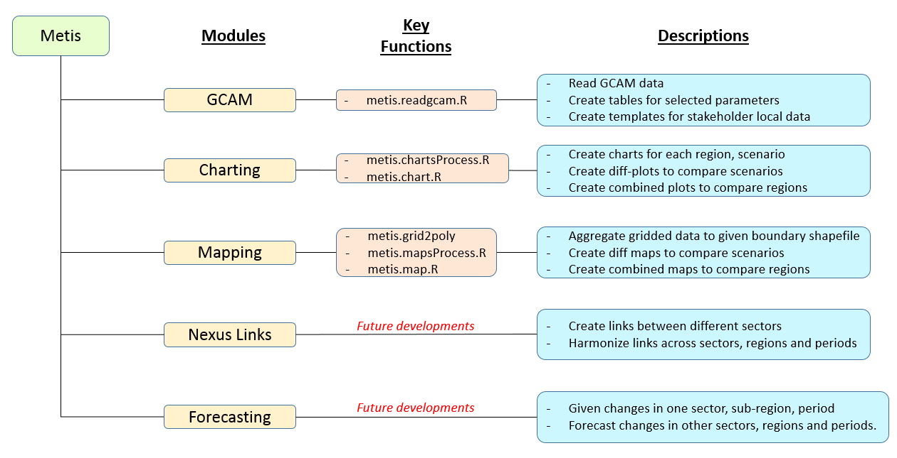

# Table of Contents

- [Summary](#Summary)
- [Need](#Need)
- [Installation Guide](#InstallGuide)
- [Framework](#Framework)
- [Step-by-step walkthrough](#WalkThrough) 
    + [Module GCAM](#ModuleGCAM)
    + [Module Chart](#ModuleChart)


# <a name="Introduction"></a>Introduction

The overall goal of the Metis model is to develop a framework to analyze dynamics across multiple sectors including water, energy, land and socio-economics at various spatial and temporal scales. The Metis model is designed to be a flexible tool to be used in conjunction with both global integrated assessment models (IAMs) which capture global dynamics as well as more detailed models which can capture specific sub-regional and sectoral details at finer resolutions. Metis integrates with these other tools by sharing data in standarized formats across the platforms. 

The model is composed of different modules as shown in Figure 1. The first three modules, currently under development: "GCAM", "Charting" and "Mapping", serve as a multi-sector accounting tool which can be used to visualize and analyze demands, supplies and distribution of various resources across multiple sectors at flexible sub-regional scales. The "Nexus Links" and "Forecasting" modules, to be developed, will focus on understanding the links between the different sectors and sub-regions to allow analyis of cross-sector dynamics. The modules are designed to be flexible and easy to use by multiple stakeholders wut varying needs. 

- The Metis modeling development platform is hosted on github at: https://github.com/zarrarkhan/metis
- The address to clone this repo is: https://github.com/zarrarkhan/metis.git
- The model is comprised of an R package and additional files with sample data

<p align="center"> <b> Figure 1: Metis Overall framework </b> </p>
<p align="center"> </p>

# <a name="Need"></a>Need

The motivation behind developing the Metis model is to bridge the gap between models working at different spatial and temporal resolutions. Sector specific details such as diurnal electricity demand profiles and the availability of intermittent technologies are often captured by fine resolution sector specific models. These finer scale models are however often limited in scope to the specific sector in question. With increasing pressures on limited resources from growing populations, technological advances and a changing climate the links across human-earth systems are becoming more critical. These links include feedbacks across system such as water demands for powerplant cooling and hydropower; energy demands for water purification, transfers and distribution; both energy and water demands for agriculture production and harvesting; and the impacts of land-use change emissions and water demands as a result of biofuel expansion and deforestation. All of these are driven by socio-economic developments and policy decisions across these systems. Global integrateed assessment models are often used to capture these broader longterm dynamics on larger spatial and temporal scales. The development of the Metis model will address this need to capture both broader long-term dynamcis across systems and global markets as well as sub-regional details. The model will do this by taking global data and dynamcis from an IAM such as GCAM and then downscale the results to relevant sub-regional boundaries based on the needs of local stakeholders. The downscaled data will then be refined and calibrated with local sector specific data. This will be followed by calibration of the local inter-sectoral links and the model will then be used for future sector specific policy analysis at the relevant scales while still including global dynamics.


# <a name="InstallGuide"></a>Installation Guide

1. Clone the repo from github:

```r
# Download a git software (eg. https://git-scm.com/downloads)
# Clone repo
git clone https://github.com/zarrarkhan/metis.git

# Or download from github https://github.com/zarrarkhan/metis 
```  

2. Open the "metis.master.R"" file which contains code to help install and run remaining model.


3. Install the R package - Metis (This code is also part of the "metis.master.R"" file):

```r
# Check and load required packages (devtools, metis, rgcam)
if("devtools" %in% rownames(installed.packages()) == F){install.packages("devtools")}
library(devtools)
if("metis" %in% rownames(installed.packages()) == F){install_github(repo="zarrarkhan/metis")}
library(metis)
if("rgcam" %in% rownames(installed.packages()) == F){install_github(repo="JGCRI/rgcam")}
library(rgcam)
```  

# <a name="Framework"></a> Framework

The framework for data processing, charting and mapping is shown in Figure 2.

<p align="center"> <b> Figure 2: Metis Current </b> </p>
<p align="center"> </p>

Links between sub-regions and sectors as well as the forecasting modules will be developed in future versions of the model.

# <a name="WalkThrough"></a> Step-by-step Walkthrough

## <a name="ModuleGCAM"></a> Module GCAM

<b> Key Inputs </b>  

- GCAM data: A gcamdatabase OR a gcamdata ".proj"" file (with complete paths)
- Query File: An ".xml" query file (with complete paths)


The model comes with an example gcamdatabase ".proj" file called "Example_dataProj.proj" which is lying the folder metis/dataFiles/gcam/ as shown in the figure below. It is recommended that other gcamdatabases are also kept in this folder. GCAM produces an output in the form of a database. The database contains outputs from various scenario runs. "metis.readgcam" uses another package "rgcam" to connects with the gcam database and retrieves data based on "queries" provided in an ".xml" file. Often scenario names in the model can be long and not appropriate for final figures. This function allows you to rename the scenarios as they are read in. Once the data has been extracted from a gcam database it is saved in a ".proj" file. Reading data from the gcam database can take a considerable amount of time depending on the number of scenarios it contains. The "metis.readgcam" function gives the option of directly providing a ".proj" which can be loaded directly or using the ".proj" file from a previous run by setting the parameter "reReadData" to FALSE. If "reReadData" is set to FALSE the function will first search for a user provided ".proj" file (which is entered in the param "dataProj"), then in the "inputs/gcam" folder and if it doesn't exist will give an error message. If "reReadData" is set to TRUE then the function will create a file called "dataProj.proj" in the same folder as the GCAM database. The code below shows how to read in data using the database or .proj file. The user can choose the regions of interest.

<p align="center"> <b> GCAM data </b> </p>
<p align="center"> </p>


```r
#----------------------------
# Install The Metis Package
#----------------------------
if("devtools" %in% rownames(installed.packages()) == F){install.packages("devtools")}
library(devtools)
if("metis" %in% rownames(installed.packages()) == F){install_github(repo="zarrarkhan/metis")}
library(metis)
if("rgcam" %in% rownames(installed.packages()) == F){install_github(repo="JGCRI/rgcam")}
library(rgcam)
library(tibble)
library(dplyr)

#----------------------------
# Read GCAM Data
#---------------------------

# ?metis.readgcam # For more details on the function.


gcamdatabasePath <-paste(getwd(),"/dataFiles/gcam",sep="")
gcamdatabaseName <-"example_database_basexdb"
gcamdataProjFile <-"Example_dataProj.proj"
regionsSelect <- c("Colombia","Argentina")
# Choose Parameters or set to "All" for all params. For complete list see ?metis.readgcam
paramsSelect=c("finalNrgbySec", "primNrgConsumByFuel", "elecByTech",
               "watConsumBySec", "watWithdrawBySec", "watWithdrawByCrop", "watBioPhysCons",
               "gdpPerCapita", "gdp", "gdpGrowthRate", "pop",
               "agProdbyIrrRfd","agProdByCrop",
               "landIrrRfd", "aggLandAlloc","co2emissionByEndUse", "ghgEmissionByGHG", "ghgEmissByGHGGROUPS")

# Use function localDBConn from package rgcam to get a list of scenarios if needed.
# localDBConn(gcamdatabasePath,gcamdatabaseName)

dataGCAM<-metis.readgcam(reReadData=F, # Default Value is T
                       dataProj=gcamdataProjFile, # Default Value is "dataProj.proj"
                       scenOrigNames=c("ExampleScen1","ExampleScen2"),
                       scenNewNames=c("Eg1","Eg2"),
                       gcamdatabasePath=gcamdatabasePath,
                       gcamdatabaseName=gcamdatabaseName,
                       queryxml="metisQueries.xml",  # Default Value is "metisQueries.xml"
                       dirOutputs= paste(getwd(),"/outputs",sep=""), # Default Value is paste(getwd(),"/outputs",sep="")
                       regionsSelect=regionsSelect, # Default Value is NULL
                       paramsSelect=paramsSelect # Default value is "All"
                       )

dataGCAM$data # To view the data read that was read.
                       
```  

The function metis.readgcam() returns a list which contains a dataframe with the values it read from the database. In this case it is saved in the variable dataGCAM. The function will save the data as a .csv file for each region and one .csv for all regions. In addition the function will produce an empty template data table for each region to be shared with local stakeholders so they can fill in their data. If not specified then all these tables will be default go to a folder called outputs/Tables as shown in the figure below. Once the empty template tables are filled with appropriate local data these can be saved in the folder outputs/Tables/Tables_Local.

<p align="center"> <b> GCAM data tables</b> </p>
<p align="center"> </p>


## <a name="ModuleChart"></a> Module Chart

<b> Key Inputs </b>  

- rTable: An rTable which can be the output of metis.readgcam() OR/AND
- dataTable: A .csv table which can be the original or modified tables produced by metis.readgcam
- (Optional) paramsSelect: A subset of the parameters read using the query file. 
- (Optional) regionsSelect: A subset of the regions available in the data.
- (Optional) scenRef: Select a scenario which will be used as a reference to compare differences with other scenarios.


After running metis.chartsProcess several charts will be produced. These will be saved in separate folders for each region and then with each there will be a folder called regional inside which will be the outputs for each scenario and then a folder for cross-scenario comparisons. The folder paths are shown in the figure below. In addition to the individual regional folders a folder called compareRegions will contain inter-regional comparisons.

```r
#----------------------------
# Produce Data Charts
#---------------------------

# ?metis.chartsProcess # For more help on charting process

# Read in Tables (If exist)
dataTables<-c(paste(getwd(),"/outputs/Tables/Tables_Local/local_Regional_Colombia.csv",sep=""),
              paste(getwd(),"/outputs/Tables/Tables_Local/local_Regional_Argentina.csv",sep=""))

# Read in the data from the function metis.readgcam
rTable <- dataGCAM$data;
unique(rTable$param)

# Choose Parameters or set to "All" for all params
paramsSelect=c("gdp","finalNrgbySec")
regionsSelect=c("Argentina","Colombia")

charts<-metis.chartsProcess(rTable=rTable, # Default is NULL
                          dataTables=dataTables, # Default is NULL
                          paramsSelect=paramsSelect, # Default is "All"
                          regionsSelect=regionsSelect, # Default is "All"
                          xCompare=c("2015","2035","2050","2100"), #Default: c("2015","2030","2050","2100")
                          scenRef="Eg1", # Default is NULL
                          dirOutputs=paste(getwd(),"/outputs",sep=""), #Default: paste(getwd(),"/outputs",sep="")
                          pdfpng="png" # Default is "png"
                          )
```

<p align="center"> <b> metis.chartsProcess Outputs </b> </p>
<p align="center"> </p>

