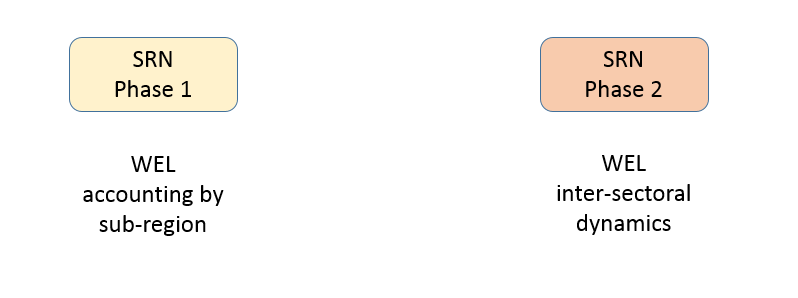
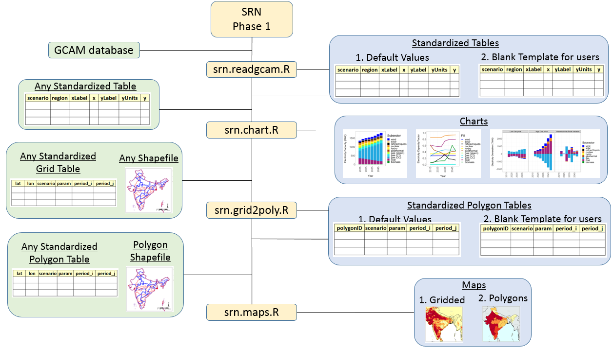

# Introduction

- This repository hosts the Sub-Regional Nexus (SRN) modeling development platform.
- Link to this repo is: https://github.com/zarrarkhan/srn
- The address to clone this repo is: https://github.com/zarrarkhan/srn.git

The overall goal of the SRN model is develop a framework which integrates GCAM and various other submodules to analyze several sectors including water, energy, land, socio-economics at various spatial and temporal scales. 

__**Figure 1: SRN Phases**__

__**Figure 2: SRN Phase 1 Structure**__

