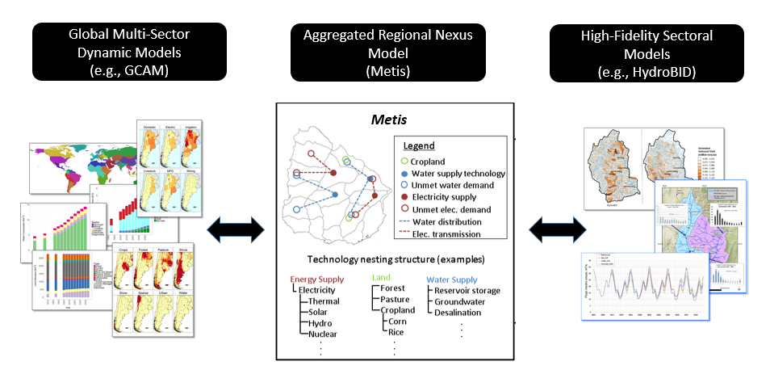
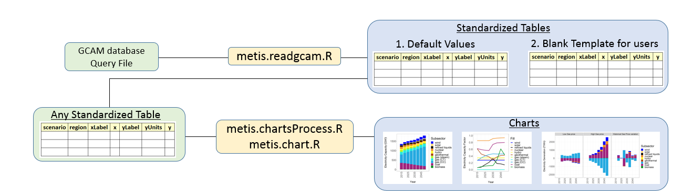
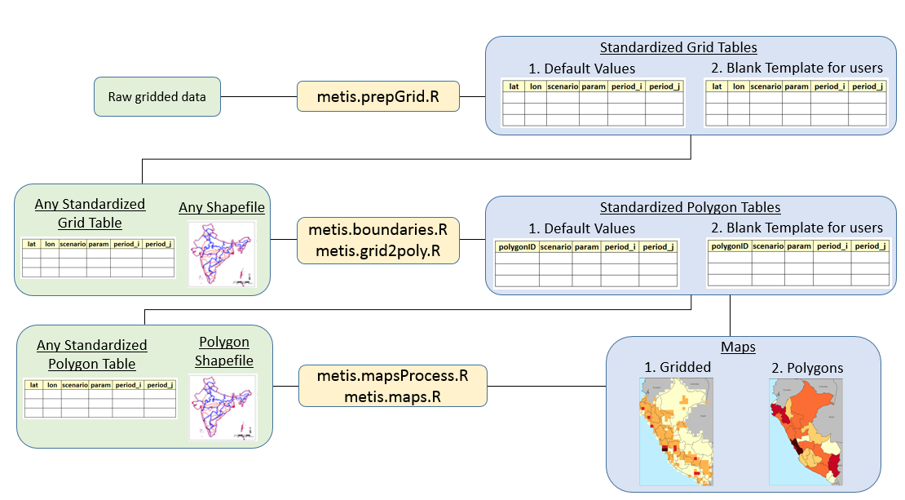
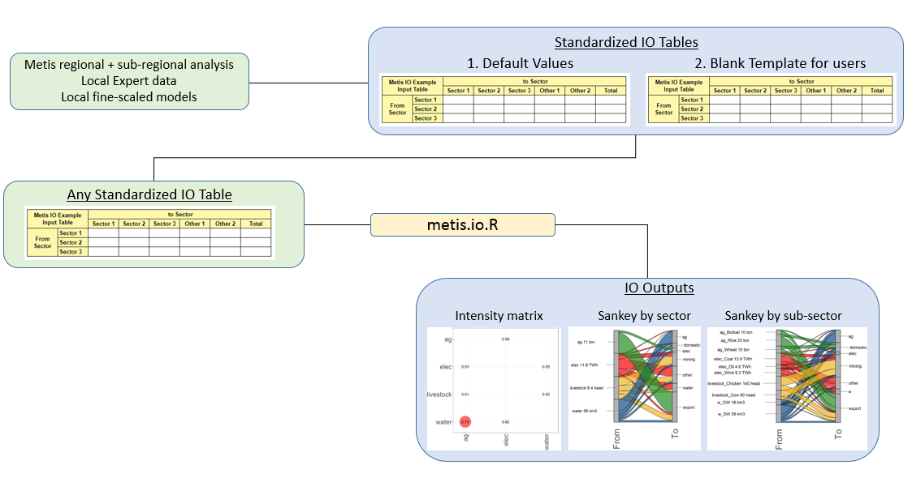
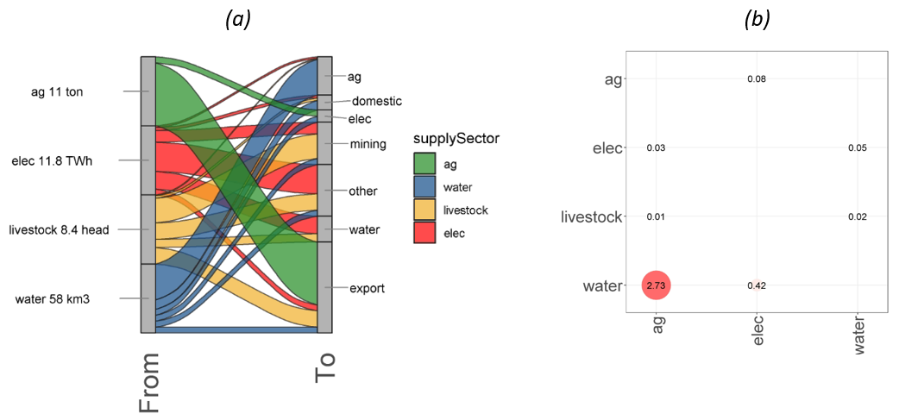
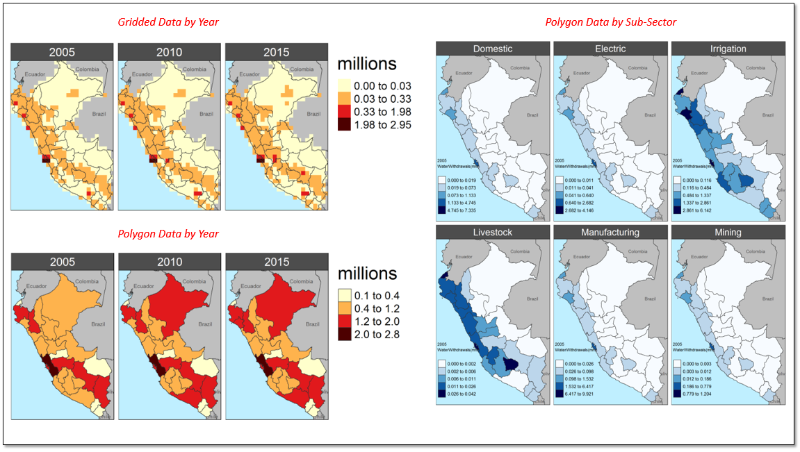

<p align="center"> </p>
<p align="center"> </p>
<p align="center"> </p>

<!-- ------------------------>
<!-- ------------------------>
# <a name="Contents"></a>Contents
<!-- ------------------------>
<!-- ------------------------>

- [Introduction](#Introduction)
- [Need](#Need)
- [Framework](#Framework)
- [Installation Guide](#InstallGuide)
- [Metis Step-by-step walkthrough](#WalkThrough) 
    + [metis.readgcam.R](#metis.readgcam.R)
    + [metis.chart.R](#metis.chart.R)
    + [metis.chartsProcess.R](#metis.chartsProcess.R)
    + [metis.map.R](#metis.map.R)
    + [metis.boundaries.R](#metis.boundaries.R)
    + [metis.grid2poly.R](#metis.grid2poly.R)
    + [metis.mapProcess.R](#metis.mapProcess.R)
    + [metis.io.R](#metis.io.R)
- [Under development](#underDevelopment) 
    + [metis.infra.R](#metis.infra.R)
  
<!-- ------------------------>
<!-- ------------------------>
# <a name="Introduction"></a>Introduction
<p align="center"> </p>
<!-- ------------------------>
<!-- ------------------------>

[Back to Contents](#Contents)

The Metis model is a joint effort by the Pacific Northwest National Laboratory (PNNL) and the University of Maryland (UMD). Metis provides a framework allowing analysis of dynamics across multiple sectors including water, energy, land and socio-economics at various spatial and temporal scales. It is designed to be a flexible tool which can take inputs from both global integrated assessment models (IAMs) which capture global dynamics as well as more detailed models which can capture specific sub-regional and sectoral details at finer resolutions. Metis integrates across tools by sharing data in standardized formats.

In most projects looking at multi-sector dynamics one of the key constraints is data availability and a key goal of Metis is to overcome this barrier by providing users with default data across sectors for their specific region. The default data is built from outputs of the open-source Global Change Assessment Model (GCAM) eco-system which provides downscaled gridded global data for water, energy and land. Metis aggregates gridded data to any spatial boundary and offers users a first look at the water-energy-land situation in their regions of interest. The idea is to use this as a starting point and then improve the data as and when it becomes available while working with local stakeholders. 

After aggregating data to relevant spatial and temporal scales, Metis finds relationships between the sectors using input/output methods to establish correlation matrices. The correlation matrices represent the inter-sectoral links throughout the system and are then used to investigate impacts of changes in one sector on others.

<p align="center"> <b> Metis - A model to bridge the gap between coarse resolution IAMs and finer-resolution sector specific models </b> </p>
<p align="center"> </p>

- The Metis modeling development platform is hosted on github at: https://github.com/JGCRI/Metis
- To clone this repo is: https://github.com/JGCRI/Metis.git
- The model is comprised of an R package and additional files with sample data


<!-- ------------------------>
<!-- ------------------------>
# <a name="Need"></a>Need
<p align="center"> </p>
<!-- ------------------------>
<!-- ------------------------>

[Back to Contents](#Contents)

The motivation behind developing the Metis model is to bridge the gap between models working at different spatial and temporal resolutions. Sector specific details such as diurnal electricity demand profiles and the availability of intermittent technologies are often captured by fine resolution sector specific models. These finer scale models are however often limited in scope to the specific sector in question. With increasing pressures on limited resources from growing populations, technological advances and a changing climate the links across human-earth systems are becoming more critical. These links include feedbacks across system such as water demands for power plant cooling and hydro power; energy demands for water purification, transfers and distribution; both energy and water demands for agriculture production and harvesting; and the impacts of land-use change emissions and water demands as a result of bio-fuel expansion and deforestation. All of these are driven by socio-economic developments and policy decisions across these systems. Global integrated assessment models are often used to capture these broader long-term dynamics on larger spatial and temporal scales. The development of the Metis model will address this need to capture both broader long-term dynamics across systems and global markets as well as sub-regional details. The model will do this by taking global data and dynamics from an IAM such as GCAM and then downscale the results to relevant sub-regional boundaries based on the needs of local stakeholders. The downscaled data will then be refined and calibrated with local sector specific data. This will be followed by calibration of the local inter-sectoral links and the model will then be used for future sector specific policy analysis at the relevant scales while still including global dynamics.


<!-- ------------------------>
<!-- ------------------------>
# <a name="Framework"></a> Framework
<p align="center"> </p>
<!-- ------------------------>
<!-- ------------------------>

[Back to Contents](#Contents)

Metis is designed to be accesible to a range of stakeholders with varying expertise and goals related to nexus analyses. The various functions of Metis can be used independently for different purposes ranging from visualization, charting, spatial aggregation, mapping and inter-sectoral dynamics. The following lists and figure provides a summary of the existing and planned capabilities of Metis. The lists and figure are updated as progress is made and new developments are planned. 

<p align="left"> <b> Metis Module & Functions </b> </p>

- Charts: Various functions to produce charts to compare outputs across regions and scenarios (functions: metis.chart.R, metis.chartsProcess.R)
- Maps: Various functions to vizualize spatial boundaries and data as rasters and polygon
(functions: metis.boundaries.R, metis.map.R, metis.mapProcess.R)
- Spatial Aggregation: Functions to aggregate gridded data to different spatial boundaries.
(functions: metis.grid2poly.R)
- Data preparation: Functions to prepare data from other modules into the appropriate format.
(functions: metis.readgcam.R, metis.prepGrid.R)
- Input/Output (IO) Analysis: Functions to build IO inter-sectoral tables and sankey diagrams.
(functions: metis.io.R)

<p align="left"> <b> Under Development </b> </p>

- Flows: Module to route water through upstream and downstream sub-regions.
- Infrastructure: Optimization module to find infrastructure development options to address supply-demand gaps. (functions: metis.infra.R)

<p align="center"> </p>


<!-- ------------------------>
<!-- ------------------------>
# <a name="InstallGuide"></a>Installation Guide
<p align="center"> </p>
<!-- ------------------------>
<!-- ------------------------>

[Back to Contents](#Contents)

1. Clone the repo from github:

```r
# Download a git software (eg. https://git-scm.com/downloads)
# Clone repo
git clone https://github.com/JGCRI/metis.git

# Or download directly from github https://github.com/JGCRI/metis
```  

2. Download and install:
    + R (https://www.r-project.org/)
    + R studio (https://www.rstudio.com/) 
    + (For Windows) Rtools (https://cran.rstudio.com/bin/windows/Rtools/)

3. Download and install Image Magick (https://imagemagick.org/script/download.php) (Used to create animations)

4. Open the metis.Rproj file.

5. Open the "metis.master.R"" file which contains code to help install and run remaining model.


```r
#----------------------------
# Install necessary packages
#----------------------------

# Devtools
# ---------
# For updated instructions and additional operating systems see: 
# https://www.rstudio.com/products/rpackages/devtools/
# https://johnmuschelli.com/neuroc/installing_devtools/index.html
# Windows: no additional steps
# UBUNTU: sudo apt-get install build-essential libcurl4-gnutls-dev libxml2-dev libssl-dev

# GDAL
# --------
# For updated instructions and additional operating systems see: 
# https://github.com/r-spatial/sf/
# https://gdal.org/download.html
# Windows: no additional steps
# UBUNTU: 
# sudo add-apt-repository ppa:ubuntugis/ubuntugis-unstable
# sudo apt-get update
# sudo apt-get install libudunits2-dev libgdal-dev libgeos-dev libproj-dev
# MacOS (Using homebrew):
# brew install pkg-config
# brew install gdal

# Image Magick
# -------------
# For updated instructions and additional operating systems see: 
# https://cran.r-project.org/web/packages/magick/vignettes/intro.html
# Windows: no additional steps
# UBUNTU: sudo apt-get install libmagick++-dev
# MacOS (Using Homebrew): brew install imagemagick@6

if("devtools" %in% rownames(installed.packages()) == F){install.packages("devtools")}; library(devtools)
if("rgcam" %in% rownames(installed.packages()) == F){install_github(repo="JGCRI/rgcam")}; library(rgcam)
if("metis" %in% rownames(installed.packages()) == F){devtools::install()}; library(metis)
library(ggalluvial);library(tibble);library(dplyr);library(rgdal)

```  

6. After downloading and unzipping you should have the following folder structure with the following sub-folders in ./metis/datafiles:
- examples: Contains example shapefiles, as well as gridded and polygon data to work with
- gcam: Contains an example gcam run output
- gis: This folder contains shape files for gcam regions, gcam basins and naturalEarth adminstrative boundaries.
- mapping: This contains two files which are used to map color palettes and other parameters not provided by stakeholder tables.

<details><summary>Click here to expand for further details, code and example figures.</summary>
<p>

<p align="center"> <b> Metis Initial Folders </b> </p>
<p align="center"> </p>

</p>
</details>


<!-- ------------------------>
<!-- ------------------------>
# <a name="WalkThrough"></a> Metis Step-by-step Walkthrough
<p align="center"> </p>
<!-- ------------------------>
<!-- ------------------------>

[Back to Contents](#Contents)

This section walks through the different features of the metis package using the example data provided in order to familiarize the user with the different functions. The following sections describes different functions within the metis package and provides example code to test out the functionality. The same code for each function is also available as a single script in the metis.master.R file in the metis parent directory. All metis R functions are stored in ./metis/R. The key functions available are:

| Function  | Description |
| ------------- | ------------- |
| metis.io.R  | This function is designed to interact specifically with GCAM outputs. The function processes GCAM outputs into .csv files by GCAM region which can then be used as inputs to metis.chartsProcess.R |
| metis.readgcam.R  | This functions is designed to interact specifically with GCAM outputs. The function processes GCAM outputs into .csv files by GCAM region which can then be used as inputs to metis.chartsProcess.R |
| metis.chart.R  | metis charting function which allows quick and easy access to features like facets, labels and colors. The function is based on ggplot and returns a ggplot chart.  |
| metis.chartsProcess.R  | metis charting function used to compare scenarios and regions. The function also creates diff plots with percentage and absolute differences from a given reference scenario.  |
| metis.map.R  | metis mapping function to plot raster and polygon data. The function uses the tmap package and returns a tmap object. Several maps can be combined by overlaying and underlaying using this function. Options allow for different colors palettes, labels, text-size as well as legend breaks which are freescale, kmeans or equally divided to highlight different kinds of data.  |
| metis.boundaries.R  | metis mapping function to plot shape file boundaries and surrounding regions for quick visualization of region of interest.  |
| metis.grid2poly.R  | Function used to crop and aggregate gridded data by a given polygon shape file. If no grid is provided the function can still be used to produce regional and subregional maps  |
| metis.mapProcess.R  | metis mapping function used to compare across scenarios. The function produces diff maps with percentage and absolute differences from a given reference scenario.  |
| metis.prepGrid.R  | This function is designed to be used with specific open-source downscaling models Xanthos, Demeter and Tethys which downscale GCAM data to the grid level. The function takes outputs from these various models and processes them into the metis format which is then used as an input to the metis.mapProcess.R function.  |
| metis.assumptions.R  | Contains all conversions and assumptions used in the model  |
| metis.colors.R  | Collection of metis color palettes. A list of palettes can be viewed in the function help file (?metis.colors). To view a particular palette metis.colors("pal_hot")  |


<details><summary>Click here to expand for further details, code and example figures.</summary>
<p>

<p align="center"> <b> Metis Functions </b> </p>
<p align="center"> </p>


The workflow for data processing, charting and mapping is shown below. The following subsections will guide the user through each of these processes further expaning on the functionality within each of the functions.

<p align="center"> <b> Metis charts, maps and IO workflows </b> </p>
<p align="center"> </p>
<p align="center"> </p>
<p align="center"> </p>

</p>
</details>


<!-- ------------------------>
<!-- ------------------------>
## <a name="metis.io"></a> metis.io
<p align="center"> </p>
<!-- ------------------------>
<!-- ------------------------>

[Back to Contents](#Contents)


<b> Key Inputs </b>  
- ioTable0: An input-output table with flow of commodity from a "supplySector" or "supplySubSector" to other sectors.

metis.io.R is the Metis function to analyze inter-sectoral intensities. metis.io.R uses an input/output methodology [4] to calculate linear intensity co-efficient matrices. The function accepts a table of values giving flows of commodities labelled “supplySector” to any number of other sectors including the “supplySector” categories. The function then finds inter-sectoral links by analyzing the flows from given supply sectors to other supply sector categories within the region. Outputs of the function include tables, bubble charts and Sankey diagrams showing the intensity matrices and inter-sectoral links as shown in the example figures below.

<p align="center"> <b> metis.io.R examples (a) Sankey diagram (b) Inter-sectoral intensity matrix as a bubble chart </b> </p>
<p align="center"> </p>


<details><summary>Click here to expand for further details, code and example figures.</summary>
<p>


```r
#----------------------------
# Input/Output (metis.io.R)
#---------------------------

# IO test 1 - Simple
    ioTable0=tibble::tribble( # Initial Flows
      ~supplySubSector,  ~water,  ~ag,   ~elec,  ~domestic, ~export, ~mining, ~other, ~units,
      "water",            0,    30,      5,        8,         5,       5,    5, "km3",
      "ag",               0,    0,      1,        0,          10,      0,    0, "ton",
      "elec",             3,    0.3,    0,        0.5,        1,       2,    5, "TWh",
      "livestock",        1,    0.1,    0,        0.3,        2,       3,    2, "head");ioTable0
    
    
    io<-metis.io(ioTable0 = ioTable0, folderName = "metisExample",plotSankeys=T, nameAppend = "_testSimple")
    # View Outputs
    io$A
    io$L
    io$ioTbl


# IO test 2 with subSectors
    ioTable0=tibble::tribble( # Initial Flows
      ~supplySubSector,  ~supplySector, ~w_GW,  ~ag_Wheat,   ~elec_Coal,  ~domestic, ~export, ~mining, ~other, ~units,
      "w_GW",            "water",     0,    10,      1,        3,         1,       2,    1, "km3",
      "w_SW",            "water",     0,    30,      5,        8,         5,       5,    5, "km3",
      "ag_Biofuel",      "ag",        0,    0,       2,        0,         8,       0,    0, "ton",
      "ag_Wheat",        "ag",        0,    0,       0,        6,         9,       0,    0, "ton",
      "ag_Rice",         "ag",        0,    0,       0,        5,         20,      0,    0, "ton",
      "elec_Coal",       "elec",      3,    0.3,     0,        0.6,       1,       3,    6, "TWh",
      "elec_Wind",       "elec",      2,    0.2,     0,        0.4,       0.677,   2,    4, "TWh",
      "elec_Oil",        "elec",      1,    0.1,     0,        0.2,       0.333,   1,    2, "TWh",
      "livestock_Cow",   "livestock", 0,    0,       0,        0,         30,      60,   0, "head",
      "livestock_Chicken","livestock",0,    0,       0,        0,         50,      90,   0, "head");ioTable0
    
    
    io_sub<-metis.io(ioTable0 = ioTable0, folderName = "metisExample",plotSankeys=T, nameAppend = "_testSubSector")
    # View Outputs
    io_sub$A
    io_sub$L
    io_sub$ioTbl
                       
```  

</p>
</details>


<!-- ------------------------>
<!-- ------------------------>
## <a name="metis.readgcam.R"></a> metis.readgcam.R
<p align="center"> </p>
<!-- ------------------------>
<!-- ------------------------>

[Back to Contents](#Contents)


<b> Key Inputs </b>  

- GCAM data: A gcamdatabase OR a gcamdata ".proj"" file (with complete paths)
- Query File: An ".xml" query file (with complete paths)


The model comes with an example gcamdatabase ".proj" file called "Example_dataProj.proj" which lies in the folder metis/dataFiles/gcam/ as shown in the figure below. It is recommended that other gcamdatabases are also kept in this folder. GCAM produces an output in the form of a database. The database contains outputs from various scenario runs. "metis.readgcam" uses another package "rgcam" to connects with the gcam database and retrieves data based on "queries" provided in an ".xml" file. Often scenario names in the model can be long and not appropriate for final figures. This function allows you to rename the scenarios as they are read in. Once the data has been extracted from a gcam database it is saved in a ".proj" file. Reading data from the gcam database can take a considerable amount of time depending on the number of scenarios it contains. The "metis.readgcam" function gives the option of directly providing a ".proj" which can be loaded directly or using the ".proj" file from a previous run by setting the parameter "reReadData" to FALSE. If "reReadData" is set to FALSE the function will first search for a user provided ".proj" file (which is entered in the param "dataProj"), then in the "inputs/gcam" folder and if it doesn't exist will give an error message. If "reReadData" is set to TRUE then the function will create a file called "dataProj.proj" in the same folder as the GCAM database. The code below shows how to read in data using the database or .proj file. The user can choose the regions of interest.

<details><summary>Click here to expand for further details, code and example figures.</summary>
<p>

<p align="center"> <b> GCAM data </b> </p>
<p align="center"> </p>


```r
#----------------------------
# Read GCAM Data (metis.readgcam.R)
#---------------------------

# Connect directly to a gcam database and produce a .proj file for future uses.
  # gcamdatabasePath_i <-paste(getwd(),"/dataFiles/gcam",sep="") # Use if gcamdatabase is needed
  # gcamdatabaseName_i <-"example_database_basexdb" # Use if gcamdatabse is needed
  # rgcam::localDBConn(gcamdatabasePath_i,gcamdatabaseName_i) # if connecting directly to gcam database

# Connect to gcam database or project
  dataProjPath_i <- paste(getwd(),"/dataFiles/gcam",sep="") # Path to dataProj file.
  dataProj_i <-"Example_dataProj.proj"  # Use if gcamdata has been saved as .proj file

# Get list of scenarios and rename if desired.
  dataProjLoaded <- loadProject(paste(dataProjPath_i, "/",dataProj_i , sep = ""))
  listScenarios(dataProjLoaded)  # List of Scenarios in GCAM database
  scenOrigNames_i = c("ExampleScen1","ExampleScen2")
  scenNewNames_i = c("Eg1","Eg2")  # Names to replace the original names for final figures.

# Choose Parameters or set to "All" for all params. For complete list see ?metis.readgcam
  paramsSelect_i = "All"

# Select regions from the 32 GCAM regions.
  regionsSelect_i <- c("Argentina","Colombia")

  dataGCAM<-metis.readgcam(reReadData = F,
                         #gcamdatabasePath = gcamdatabasePath_i,
                         #gcamdatabaseName = gcamdatabaseName_i,
                         scenOrigNames = scenOrigNames_i,
                         scenNewNames = scenNewNames_i,
                         dataProj = dataProj_i,
                         dataProjPath = dataProjPath_i,
                         regionsSelect = regionsSelect_i ,
                         paramsSelect=paramsSelect_i
                       )

  dataGCAM$data # To view the data read that was read.

                       
```  

The function metis.readgcam() returns a list which contains a dataframe with the values it read from the database. In this case it is saved in the variable dataGCAM. The function also creates a new folder "outputs" and stores GCAM data tables in this folder. The function will save the data as a .csv file for each region and one .csv for all regions. Tables with "aggClass" aggregate data across classes to provided sector summaries. In addition the function will produce an empty template data table for each region to be shared with local stakeholders so they can fill in their data. If not specified then all these tables will by default go to a folder called ./metis/outputs/readGCAMTables as shown in the figure below. Once the empty template tables are filled with appropriate local data these can be saved in the folder outputs/Tables/Tables_Local. 

<p align="center"> <b> GCAM data tables</b> </p>
<p align="center"> </p>


</p>
</details>


<!-- ------------------------>
<!-- ------------------------>
## <a name="metis.chart.R"></a> metis.chart.R
<p align="center"> </p>
<!-- ------------------------>
<!-- ------------------------>

[Back to Contents](#Contents)

metis.chart.R is the metis charting software used in metis.chartsProcess.R. It allows users to create line, bar, bubble and sankey charts. The default settings maintain a conistent look across the metis products.


<details><summary>Click here to expand for further details, code and example figures.</summary>
<p>

The following section shows some basic example to use metis.chart.R.

```r

#----------------------------
# Charts Basic (metis.chart.R)
#---------------------------

# Simple example with progressively more features
   tbl <- tribble (
   ~x,     ~value,
   2010,   15,
   2020,   20,
   2030,   30
   )
   metis.chart(data = tbl, xData = "x", yData = "value", chartType = "line", fileName = "chart_eg_line", folderName = "metisExample")
   metis.chart(data = tbl, xData = "x", yData = "value", chartType = "bar", fileName = "chart_eg_bar", folderName = "metisExample")
   metis.chart(data = tbl, xData = "x", yData = "value", chartType = "bar", color = "blue",folderName = "metisExample",
               yLabel = "New y Label", xLabel = "New X label", fileName = "chart_eg_bar_blue", title = "Title")
   # See ?metis.chart for more details on further customization eg. tick marks, title size ect.

# More detailed data with facets
   # Simple example with progressively more features
   tbl_multi <- tribble (
     ~x,     ~value, ~region,     ~scen,   ~fuel,
     2010,   25,     "region1",   "scenA",  "Oil",
     2020,   30,     "region1",   "scenA",  "Oil",
     2030,   40,     "region1",   "scenA",  "Oil",
     2010,   25,     "region2",   "scenA",  "Oil",
     2020,   10,     "region2",   "scenA",  "Oil",
     2030,   60,     "region2",   "scenA",  "Oil",
     2010,   75,     "region1",   "scenB",  "Oil",
     2020,   30,     "region1",   "scenB",  "Oil",
     2030,   20,     "region1",   "scenB",  "Oil",
     2010,   25,     "region2",   "scenB",  "Oil",
     2020,   10,     "region2",   "scenB",  "Oil",
     2030,   90,     "region2",   "scenB",  "Oil",
     2010,   55,     "region1",   "scenA",  "Gas",
     2020,   40,     "region1",   "scenA",  "Gas",
     2030,   30,     "region1",   "scenA",  "Gas",
     2010,   35,     "region2",   "scenA",  "Gas",
     2020,   30,     "region2",   "scenA",  "Gas",
     2030,   32,     "region2",   "scenA",  "Gas",
     2010,   16,     "region1",   "scenB",  "Gas",
     2020,   28,     "region1",   "scenB",  "Gas",
     2030,   39,     "region1",   "scenB",  "Gas",
     2010,   12,     "region2",   "scenB",  "Gas",
     2020,   26,     "region2",   "scenB",  "Gas",
     2030,   37,     "region2",   "scenB",  "Gas"
   )

   my_pal <- RColorBrewer::brewer.pal(9, "Set1")

   metis.chart(data = tbl_multi, xData = "x", yData = "value", class="fuel",
               chartType = "line",  classPalette=my_pal,
               facet_rows="region",facet_columns="scen",
               fileName="chart_eg_line_multi_Set1",folderName = "metisExample"
               )

   my_pal <- metis.colors()$pal_Basic

   metis.chart(data = tbl_multi, xData = "x", yData = "value", class="fuel", position="stack",
               group="fuel",chartType = "bar", classPalette=my_pal,
               facet_rows="region",facet_columns="scen",
               fileName="chart_eg_barStack_multi_palBasic",folderName = "metisExample")

   metis.chart(data = tbl_multi, xData = "x", yData = "value", class="fuel", position="dodge",
               group="fuel",chartType = "bar", classPalette=my_pal,
               facet_rows="region",facet_columns="scen",
               fileName="chart_eg_barDodge_multi_Set1",folderName = "metisExample")


# Sankey Diagram Example

   # Data Frame with 2 regions, 3 supply sectors and 3 demand sectors and random values
   df <- data.frame(region = c("A","A","A","A","A","A","B","B","B","B","B","B"),
                    supplySector = c("coal","coal","gas","gas","wind","wind","coal","coal","gas","gas","wind","wind"),
                    demandSector = c("resid","indus","ag","resid","ag","indus","resid","indus","ag","resid","indus","ag"),
                    value = c(4.70,7.33,9.52,6.5,6.70,3.57,8.43,1.68,7.61,1.10,1.58,3.45)); df

   metis.chart(data=df, chartType="sankey", yData="value", sankeyGroupColor="supplySector",
               classLabel="From", class = "supplySector", classPalette = metis.colors()$pal_Basic,
               sankeyAxis1="supplySector",sankeyAxis2="demandSector",sankeyAxis1Label ="From",sankeyAxis2Label="To",
               facet_columns="region", fileName="chart_eg_sankey_multi",folderName = "metisExample")

```

</p>
</details>


<!-- ------------------------>
<!-- ------------------------>
## <a name="metis.chartsProcess.R"></a> metis.chartsProcess.R
<p align="center"> </p>
<!-- ------------------------>
<!-- ------------------------>

[Back to Contents](#Contents)

<b> Key Inputs </b>  

- rTable: An rTable which can be the output of metis.readgcam() OR/AND
- dataTable: A .csv table which can be the original or modified tables produced by metis.readgcam
- (Optional) paramsSelect: A subset of the parameters read using the query file. 
- (Optional) regionsSelect: A subset of the regions available in the data.
- (Optional) scenRef: Select a scenario which will be used as a reference to compare differences with other scenarios.


After running metis.chartsProcess several charts will be produced. These will be saved in separate folders for each region and then within each there will be a folder for each scenario as well as a folder for cross-scenario comparisons. The folder paths are shown in the figure below. In addition to the individual regional folders a folder called compareRegions will contain inter-regional comparisons for each scenario as well as a cross-region/cross-scenario comparison.
Tables with the data used for each figure will also be provided in ./metis/outputs/Charts.

<p align="center"> <b> metis.chartsProcess Example Outputs </b> </p>
<p align="center"> </p>


<details><summary>Click here to expand for further details, code and example figures.</summary>
<p>

<p align="center"> <b> metis.chartsProcess Output folders </b> </p>
<p align="center"> </p>


```r
#------------------------------------------------------------------------------------------
# Charts Process (metis.chartsProcess.R)
#------------------------------------------------------------------------------------------

# Read in csv tables if available.
  # For example metis.readgcam.R produces datatable and templates which are saved by default in
  # ./metis/outputs/readGCAMTables/Tables_gcam/ for each gcam region selected
  # ./metis/outputs/readGCAMTables/Tables_Templates which gives an example template to fill out with local or other data.
  # Custom or local csv need to have "scenario", "region", "sources",	"param", "units",	"class",	"x",	"value"
  # As an example we are creating a local scenario for Argentina and will save it into Tables_Local.

   localData <- tibble::tribble (
     ~scenario,    ~region,     ~sources,	 ~param,          ~units,               ~class,             ~x,    ~value,
     "Local Data", "Argentina", "Sources", "finalNrgbySec", "Final Energy (TWh)", "building",        "2010", "50",
     "Local Data", "Argentina", "Sources", "finalNrgbySec", "Final Energy (TWh)", "industry",        "2010", "100",
     "Local Data", "Argentina", "Sources", "finalNrgbySec", "Final Energy (TWh)", "transportation",  "2010", "150",
     "Local Data", "Argentina", "Sources", "finalNrgbySec", "Final Energy (TWh)", "building",        "2015", "70",
     "Local Data", "Argentina", "Sources", "finalNrgbySec", "Final Energy (TWh)", "industry",        "2015", "60",
     "Local Data", "Argentina", "Sources", "finalNrgbySec", "Final Energy (TWh)", "transportation",  "2015", "70",
     "Local Data", "Argentina", "Sources",  "aggLandAlloc", "Land Allocation (1000 km^2)", "crops",           "2010", "100",
     "Local Data", "Argentina", "Sources",  "aggLandAlloc", "Land Allocation (1000 km^2)", "forest",          "2010", "200",
     "Local Data", "Argentina", "Sources",  "aggLandAlloc", "Land Allocation (1000 km^2)", "shrubs",          "2010", "30",
     "Local Data", "Argentina", "Sources",  "aggLandAlloc", "Land Allocation (1000 km^2)", "naturalOther",    "2010", "15",
     "Local Data", "Argentina", "Sources",  "aggLandAlloc", "Land Allocation (1000 km^2)", "pasture",         "2010", "220")

   localData <- localData %>% mutate(vintage="Vintage", class2="class2")

   if (!dir.exists(paste(getwd(), "/outputs", sep = ""))){dir.create(paste(getwd(), "/outputs", sep = ""))}
   if (!dir.exists(paste(getwd(), "/outputs/Charts", sep = ""))){dir.create(paste(getwd(), "/outputs/Charts", sep = ""))}
   if (!dir.exists(paste(getwd(), "/outputs/Charts/metisExample", sep = ""))){dir.create(paste(getwd(), "/outputs/Charts/metisExample", sep = ""))}
   data.table::fwrite(localData, file = paste(getwd(), "/outputs/Charts/metisExample/example_localFile.csv", sep = ""),row.names = F)
   dataTables_i =  c(paste(getwd(), "/outputs/Charts/metisExample/example_localFile.csv", sep = ""))

# Can also add data .csv outputs from metis.readgcam.R which are autmatically saved in
  # ./metis/outputs/readGCAMTables/Tables_gcam for each of the regions selected.
  # eg. gcamDataTable_Argentina.csv, gcamDataTable_China.csv, gcamDataTable_Pakistan.csv
  # This would be added to dataTables_i as:
  # dataTables_i = c(paste(getwd(), "/example_localFile.csv", sep = ""),
  #                  paste(getwd(), "outputs/readGCAMTables/Tables_gcam/gcamDataTable_Argentina.csv", sep = ""),
  #                  paste(getwd(), "outputs/readGCAMTables/Tables_gcam/gcamDataTable_China.csv", sep = ""),
  #                  paste(getwd(), "outputs/readGCAMTables/Tables_gcam/gcamDataTable_Pakistan.csv", sep = ""))

# Read in the data from the function metis.readgcam.
  rTable_i <- dataGCAM$data;


# Choose Parameters or set to "All" for all params. For complete list see ?metis.chartsProcess
  # paramsSelect_i=c("finalNrgbySec", "primNrgConsumByFuel", "elecByTech", "elecCapBySubsector",
  #                  "watConsumBySec", "watWithdrawBySec", "watWithdrawByCrop", "watBioPhysCons", "irrWatWithBasin","irrWatConsBasin",
  #                  "gdpPerCapita", "gdp", "gdpGrowthRate", "pop", "agProdbyIrrRfd",
  #                  "agProdBiomass", "agProdForest", "agProdByCrop", "landIrrRfd", "aggLandAlloc",
  #                  "finalNrgbySecDetbyFuel","finalElecbySecDet","finalElecbyServiceDet","finalNrgbySecbyFuel","finalNrgbyFuelbySec",
  #                 "co2emissionBySector","nonco2emissionBySectorGWPAR5","nonco2emissionBySectorGTPAR5","nonco2emissionBySectorOrigUnits")
  paramsSelect_i=c("gdp", "gdpGrowthRate", "pop",
                   "finalNrgbySec","elecByTech",
                   "co2emissionBySector","nonco2emissionBySectorGWPAR5",
                   "agProdByCrop","aggLandAlloc",
                   "watConsumBySec", "watWithdrawBySec")

# Select regions from the 32 GCAM regions.
  regionsSelect_i=c("Argentina","Colombia")

# Charts Process
  charts<-metis.chartsProcess(rTable=rTable_i, # Default is NULL
                          dataTables=dataTables_i, # Default is NULL.
                          paramsSelect=paramsSelect_i, # Default is "All"
                          regionsSelect=regionsSelect_i, # Default is "All"
                          xCompare=c("2015","2030","2050","2100"), # Default is c("2015","2030","2050","2100")
                          scenRef="Eg1", # Default is NULL
                          dirOutputs=paste(getwd(),"/outputs",sep=""), # Default is paste(getwd(),"/outputs",sep="")
                          regionCompareOnly=0, # Default 0. If set to 1, will only run comparison plots and not individual
                          scenarioCompareOnly=1,
                          folderName = "metisExample") # Default 0. If set to 1, will only run comparison plots and not individual

```

</p>
</details>


<!-- ------------------------>
<!-- ------------------------>
## <a name="metis.map.R"></a> metis.map.R
<p align="center"> </p>
<!-- ------------------------>
<!-- ------------------------>

[Back to Contents](#Contents)

metis.map.R is the metis charting software used in metis.mapProcess.R and boundaries. It allows users to map outputs to shapefile polygons and raster. The default settings maintain a conistent look across the metis products.


<details><summary>Click here to expand for further details, code and example figures.</summary>
<p>

The following section shows some basic example to use metis.map.R.


```r
#-------------------
# Maps (metis.map.R)
#-------------------

# Example 1. Using example Shapefile for US States Provided with metis in ./metis/dataFiles/examples.
  examplePolyFolder<-paste(getwd(),"/dataFiles/gis/metis/naturalEarth",sep="")
  examplePolyFile<-paste("US_states_mainland_ne1",sep="")
  exampleUSmainland=readOGR(dsn=examplePolyFolder,layer=examplePolyFile,use_iconv=T,encoding='UTF-8')
  head(exampleUSmainland@data) # Choose the appropriate column name
  colName_i = "postal"
  # Categorical Shapefile
  metis.map(dataPolygon=exampleUSmainland,fillColumn = colName_i,labels=T ,labelsAutoPlace = F, printFig=F,facetsON=F, folderName="metisExample")
  # Shapefile with values
  metis.map(dataPolygon=exampleUSmainland,fillColumn = "latitude",labels=T ,printFig=F,facetsON=T,
            legendShow = T, legendOutside = T, fillPalette = "Spectral", labelsAutoPlace = F, folderName="metisExample")

# Example 2. using the natural earth Shapefiles provided with metis in ./metis/dataFiles/gis/metis/naturalEarth
  examplePolyFolder<-paste(getwd(),"/dataFiles/gis/metis/naturalEarth",sep="")
  examplePolyFile<-paste("ne_10m_admin_1_states_provinces",sep="")
  exampleNE1=readOGR(dsn=examplePolyFolder, layer=examplePolyFile,use_iconv=T,encoding='UTF-8')
  head(exampleNE1@data) # Choose the column name
  colName_i = "name"
  # Crop the shapefile to desired boundary by subsetting
  exampleNE1Cropped = exampleNE1[exampleNE1$admin=="Peru",]
  exampleNE1Cropped@data = droplevels(exampleNE1Cropped@data)
  plot(exampleNE1Cropped)
  metis.map(dataPolygon=exampleNE1Cropped,fillColumn = colName_i,labels=T ,printFig=T,facetsON=F,
            labelsAutoPlace = F, folderName="metisExample")

# The cropped shapefile can be saved for later use if desired.
  # Create a directory to save the file to
  if (!dir.exists(paste(getwd(),"/outputs",sep=""))){dir.create(paste(getwd(),"/outputs",sep=""))}
  if (!dir.exists(paste(getwd(),"/outputs/Maps",sep=""))){dir.create(paste(getwd(),"/outputs/Maps",sep=""))}
  if (!dir.exists(paste(getwd(),"/outputs/Maps/metisExample",sep=""))){dir.create(paste(getwd(),"/outputs/Maps/metisExample",sep=""))}
  if (!dir.exists(paste(getwd(),"/outputs/Maps/metisExample/ExampleShapefile",sep=""))){
  dir.create(paste(getwd(),"/outputs/Maps/metisExample/ExampleShapefile",sep=""))}
  rgdal::writeOGR(obj=exampleNE1Cropped,
                  dsn=paste(getwd(),"/outputs/Maps/metisExample/ExampleShapefile",sep=""),
                  layer=paste("Argentina_states_example",sep=""),
                  driver="ESRI Shapefile", overwrite_layer=TRUE)


```

</p>
</details>


<!-- ------------------------>
<!-- ------------------------>
## <a name="metis.boundaries.R"></a> metis.boundaries.R
<p align="center"> </p>
<!-- ------------------------>
<!-- ------------------------>


[Back to Contents](#Contents)

<b> Key Inputs </b>  

- boundaryRegShape: A polygon shapefile which has already been read into R defining the boundary region. Default is NULL. If left NULL then a folder and filename should be specified if a boundary is desired.
- boundaryRegShpFolder: If an extended map is desired then this can be provided. naturalEarth admin boundaries are in ./metis/dataFiles/gis/metis/naturalEarth, The default value is NULL and in this case no extended boundary will be drawn.
- boundaryRegShpFile: If desired and chosen from the naturalEarth data then "ne_10m_admin_0_countries" can be chosen.
- boundaryRegCol: If boundaryRegShpFolder and File are specified then this column should be specified. If the naturalEarth data is used the column is "NAME".
- boundaryRegionsSelect: Desired boundary region. In the naturalEarth data these are country names eg. "Argentina",
- subRegShape: A polygon shapefile which has already been read into R defining the subregion boundaries. Default is NULL. If left NULL then a folder and filename should be specified.
- subRegShpFolder: Folder where subregion shapefile is saved. 
- subRegShpFile: Name of subregion shapefile.
- subRegCol: Column name in shape data which defines the different sub-regions. The sub-region shape file should be read and this column name should be checked.
- (Optional) subRegionsSelect: If desired the subregion polygons can be subset by the sub-regions specified here.
- subRegType: The kind of sub-region being analyzed e.g. "state", "subBasin" etc. 
- nameAppend: If any name should be appended to the files produced e.g. "_hydrobidBermeo3",
- extension: If the extended boundary region should be plotted with the subregion.
- overlapShpFolder: If an overlapping shapefile is desired then the folder should be specified. For example GCAM basin boundaries saved in ./metis/dataFiles/gis/metis/gcam
- overlapShpFile: Overlapping shapefile name for eg. "Global235_CLM_final_5arcmin_multipart"

metis.boundaries is used to create maps showing where the sub-region lies in the greater region. For this option a boundary region should be defined. NaturalEarth boundary region files come with the download of Metis. Once metis.boundaries has been run a folder for "Maps" is created. The Maps folder will contain a "Boundary" folder which contains the boundary files defining each region and subregion. The function also shows how different grid cells sizes compare with the selected regions. This is useful to understand if the desired regional resolution is too fine for a particular grid size. The folder structure and example output boundary maps are shown in the figures that follow.

<p align="center"> <b> metis.boundaries Outputs and Example Charts </b> </p>
<p align="center"> </p>

<details><summary>Click here to expand for further details, code and example figures.</summary>
<p>

```r

#------------
# Boundaries
#------------

# Example 1: Peru
  countryName = "Peru"
  examplePolyFolder_i<-paste(getwd(),"/dataFiles/gis/metis/naturalEarth",sep="")
  examplePolyFile_i<-paste("ne_10m_admin_1_states_provinces",sep="")
  exampleSubRegion=readOGR(dsn=examplePolyFolder_i,
                        layer=examplePolyFile_i,use_iconv=T,encoding='UTF-8')
  head(exampleSubRegion@data)
  subRegCol_i = "name"
  # Crop the shapefile to the desired subRegion
  exampleSubRegionCropped<-exampleSubRegion[(exampleSubRegion$admin==countryName),]
  head(exampleSubRegionCropped@data)
  metis.map(dataPolygon=exampleSubRegionCropped,fillColumn = subRegCol_i,labels=T ,printFig=F,facetsON=F, folderName="metisExample")

  # Can Further subset the shapefile if desired
  chosenSubRegions = c("Cusco","Madre de Dios", "Pasco")
  exampleSubRegion_chooseState<-exampleSubRegionCropped[(exampleSubRegionCropped[[subRegCol_i]] %in% chosenSubRegions),]
  exampleSubRegion_chooseState@data <- droplevels(exampleSubRegion_chooseState@data)
    head(exampleSubRegion_chooseState@data)
  metis.map(dataPolygon=exampleSubRegion_chooseState,fillColumn = subRegCol_i,labels=T ,printFig=F,facetsON=F, folderName="metisExample")

  exampleBoundaries<- metis.boundaries(
                            boundaryRegShape=NULL,
                            boundaryRegShpFolder=paste(getwd(),"/dataFiles/gis/metis/naturalEarth",sep=""),
                            boundaryRegShpFile=paste("ne_10m_admin_0_countries",sep=""),
                            boundaryRegCol="ADMIN",
                            boundaryRegionsSelect=countryName,
                            subRegShape=exampleSubRegionCropped,
                            subRegCol=subRegCol_i,
                            subRegType="state",
                            nameAppend="_example",
                            expandPercent=2,
                            overlapShpFile="Global235_CLM_final_5arcmin_multipart",
                            overlapShpFolder=paste(getwd(),"/dataFiles/gis/metis/gcam",sep=""),
                            extension = T,
                            grids = c(paste(getwd(),"/dataFiles/grids/emptyGrids/grid_025.csv",sep=""),
                                      paste(getwd(),"/dataFiles/grids/emptyGrids/grid_050.csv",sep="")),
                            folderName="metisExample")

# Example 2: USA
  countryName = "United States of America"
  examplePolyFolder_i<-paste(getwd(),"/dataFiles/gis/metis/naturalEarth",sep="")
  examplePolyFile_i<-paste("US_states_mainland_ne1_states",sep="")
  exampleSubRegion=readOGR(dsn=examplePolyFolder_i,layer=examplePolyFile_i,use_iconv=T,encoding='UTF-8')
  head(exampleSubRegion@data)
  subRegCol_i = "postal"
  # Crop the shapefile to the desired subRegion
  exampleSubRegionCropped<-exampleSubRegion[(exampleSubRegion$admin==countryName),]
  head(exampleSubRegionCropped@data)
  metis.map(dataPolygon=exampleSubRegionCropped,fillColumn = subRegCol_i,labels=T ,printFig=F,facetsON=F, folderName="metisExample")

  # Can Further subset the shapefile if desired
  chosenSubRegions = c("CA","NV","UT","CO","AZ","TX","OK","WY","TX")
  exampleSubRegion_chooseState<-exampleSubRegionCropped[(exampleSubRegionCropped[[subRegCol_i]] %in% chosenSubRegions),]
  exampleSubRegion_chooseState@data <- droplevels(exampleSubRegion_chooseState@data)
  head(exampleSubRegion_chooseState@data)
  metis.map(dataPolygon=exampleSubRegion_chooseState,fillColumn = subRegCol_i,labels=T ,printFig=F,facetsON=F, folderName="metisExample")

  exampleBoundaries<- metis.boundaries(
                          boundaryRegShape=NULL,
                          boundaryRegShpFolder=paste(getwd(),"/dataFiles/gis/metis/naturalEarth",sep=""),
                          boundaryRegShpFile=paste("ne0_USMainLand_cropped",sep=""),
                          boundaryRegCol="ADMIN",
                          boundaryRegionsSelect=countryName,
                          subRegShape=exampleSubRegionCropped,
                          subRegCol=subRegCol_i,
                          subRegType="state",
                          nameAppend="_example",
                          expandPercent=10,
                          overlapShpFile="Global235_CLM_final_5arcmin_multipart",
                          overlapShpFolder=paste(getwd(),"/dataFiles/gis/metis/gcam",sep=""),
                          extension = T,
                          #grids = c(paste(getwd(),"/dataFiles/grids/emptyGrids/grid_025.csv",sep=""),
                          #          paste(getwd(),"/dataFiles/grids/emptyGrids/grid_050.csv",sep="")),
                          folderName="metisExample")

  exampleBoundaries<- metis.boundaries(
                            boundaryRegShape=NULL,
                            boundaryRegShpFolder=paste(getwd(),"/dataFiles/gis/metis/naturalEarth",sep=""),
                            boundaryRegShpFile=paste("ne0_USMainLand_cropped",sep=""),
                            boundaryRegCol="ADMIN",
                            boundaryRegionsSelect=countryName,
                            subRegShape=exampleSubRegion_chooseState,
                            subRegCol=subRegCol_i,
                            subRegType="state",
                            nameAppend="_exampleSubset",
                            expandPercent=10,
                            overlapShpFile="Global235_CLM_final_5arcmin_multipart",
                            overlapShpFolder=paste(getwd(),"/dataFiles/gis/metis/gcam",sep=""),
                            extension = T,
                            grids = c(paste(getwd(),"/dataFiles/grids/emptyGrids/grid_025.csv",sep=""),
                                      paste(getwd(),"/dataFiles/grids/emptyGrids/grid_050.csv",sep="")),
                            folderName="metisExample")


```

</p>
</details>

<!-- ------------------------>
<!-- ------------------------>
## <a name="metis.grid2poly.R"></a> metis.grid2poly.R
<p align="center"> </p>
<!-- ------------------------>
<!-- ------------------------>

[Back to Contents](#Contents)

<b> Key Inputs </b>  

- grid: Grid file with lat and lon coordinates. 
- boundaryRegionsSelect: Name of general region. The model will create a folder for each region.
- (Optional) subRegShape: A polygon shapefile which has already been read into R defining the subregion boundaries. Default is NULL. If left NULL then a folder and filename should be specified.
- subRegShpFolder: Folder where subregion shapefile is saved.
- subRegShpFile: Name of subregion shapefile.  If desired and chosen from the naturalEarth data then "ne_10m_admin_1_states_provinces" can be chosen.
- subRegCol: Column name in shape data which defines the different sub-regions. The sub-region shape file should be read and this column name should be checked. For the "ne_10m_admin_1_states_provinces" data this name will be "name"
- (Optional) subRegionsSelect: If desired the subregion polygons can be subset by the sub-regions specified here.
- subRegType: The kind of sub-region being analyzed e.g. "state", "subBasin" etc. 


metis.grid2poly is used to aggregate gridded data to given sub-regional spatial scales. Depending on the type of gridded data (volume or depth) the aggregation is done based on the part of the polygon which intersect with the grid cells as shown in the figure below. 

metis.grid2poly can also be used to create maps showing where the sub-region lies in the greater region. For this option a boundary region should be defined. NaturalEarth boundary region files come with the download of Metis. Once grid2poly has been run a folder for "Maps" and a folder for "Grids" (if a grid file was provided) are created. Within the Maps folder (./metis/outputs/Maps) the user will find a Tables folder which contains all the data used to create the map as a well as a template for stakeholders to input their own data as a new scenario by sub-region. The Maps folder will also contain a "Boundary" folder which contains the boundary files defining each region and subregion and also includes shapefiles incase these need to be shared with others. The folder structure and example output boundary maps are shown in the figures that follow. If a grid has been provided then a "Grid" folder is also created which contains the cropped gridded data which can be used in for mapping.

<p align="center"> <b> metis.grid2poly metis.grid2poly conceptual aggregation methods  </b> </p>
<p align="center"> </p>


<details><summary>Click here to expand for further details, code and example figures.</summary>
<p>

```r
#-----------
# Grid to Poly
#-------------

# Example Grid File (csv with lats and lons that overlap the shapefile)
    gridExample<-paste(getwd(),"/dataFiles/examples/example_grid_Peru.csv",sep="")

# Polygons. An example Shapefile is Provided with metis in ./metis/dataFiles/examples.
    # This is the same file as produced in the boundaries example above.
    examplePolyFolder_i<-paste(getwd(),"/dataFiles/examples",sep="")
    examplePolyFile_i<-paste("Peru_subRegion_example",sep="")
    exampleSubRegionCropped=readOGR(dsn=examplePolyFolder_i,
                            layer=examplePolyFile_i,use_iconv=T,encoding='UTF-8')
    head(exampleSubRegionCropped@data) # TO choose subRegCol name
    subRegCol_i = "name"

# Run metis.grid2poly
    exampleGrid2poly<-metis.grid2poly(grid=gridExample,
                                    subRegShpFolder=examplePolyFolder_i,
                                    subRegShpFile=examplePolyFile_i,
                                    subRegCol=subRegCol_i,
                                    #aggType="depth", # Aggregation type. Depth or volume. See docuemntation for further details.
                                    nameAppend="_examplePeru",
                                    folderName="metisExample",
                                    regionName = "Peru")

```

</p>
</details>

<!-- ------------------------>
<!-- ------------------------>
## <a name="metis.mapProcess"></a> metis.mapProcess
<p align="center"> </p>
<!-- ------------------------>
<!-- ------------------------>

[Back to Contents](#Contents)

<b> Key Inputs </b>  

- polygonDataTables: Data table with data per sub-region. This can be an individual table or outputs from metis.grid2poly. The individual table cna be built from the template provided by metis.grid2poly. 
- gridDataTables: This is gridded data whith lat, lon and values. The outputs from metis.grid2poly can be used or the output can be used as a template to populates user data.
- xRange=c(2005,2010,2020): Range of years to analyze. If left blank will analyze all available years.
- boundaryRegionsSelect: Name of overall region. Will create a folder with this name. "Argentina",
- (Optional) subRegShape: If a subregional shape is already available in R. If not then the shape folder and file need to be specified in the following paramters. 
- subRegShpFolder: Sub-region shape file folder. This can be an output of metis.grid2poly and will be lying in ./metis/outputs/Grid2Poly/"REGIONX". It can also be any subregion shapefile like the ones in "./metis/dataFiles/gis"
- subRegShpFile: Sub-region shapefile name e.g. paste("bermejo3Cropped",sep=""),
- subRegCol: Columns whith unique identifiers for each sub-region. In this case e.g. "SUB_NAME". The shapefile data should be read and checked to determine this. 
- subRegType: Name the type of sub-region being analyzed. A separate folder for each type will be create. For exampel "subBasin" or "state"
- nameAppend: Any additional names to append to files.
- legendPosition: Legend position for freescale maps. Since different shapes may warrant different legend positions. Default is =c("RIGHT","top").
- scenRef: The reference scenario name. All other scenarios will use this as the base for diff maps.


After running metis.mapProcess additional folders are created in the ./metis/outputs/Maps/ folder for each region and sub-region indicated. Within each of these there are plots for each scenario as well as diff plots showing the absolute and percentage difference between the selected reference scenario and all other scenarios. Each map is produced with three kinds of legends Freescale, Kmeans and pretty (or equal breaks) which allow the user to analyze different kinds of data. THe colors schemes for the plots are determined in metis.colors and can be adjusted by advanced users. Animations showing changes through the years are also created for each type of map and legend type. Example of the folder structure and ouputs from metis.mapProcess are shown below.

<p align="center"> <b> metis.mapProcess Example Outputs Spatial Scales </b> </p>

Grid |  State
:-------------------------:|:-------------------------:
  |    

Grid |  Basin 
:-------------------------:|:-------------------------:
  |    


<details><summary>Click here to expand for further details, code and example figures.</summary>
<p>


```r
#------------------------------
# Mapping (metis.mapProcess.R)
#------------------------------

# Simple Example. See example csv tables provided for ideal column names needed.
    exampleGridTable_i<-paste(getwd(),"/dataFiles/examples/example_grid_Peru.csv",sep="")
    examplePolygonTable_i<-paste(getwd(),"/dataFiles/examples/example_poly_Peru.csv",sep="")
    gridTable=read.csv(exampleGridTable_i);head(gridTable)
    polyTable=read.csv(examplePolygonTable_i);head(polyTable)

    examplePolyFolder_i<-paste(getwd(),"/dataFiles/examples",sep="")
    examplePolyFile_i<-paste("Peru_subRegion_example",sep="")
    exampleSubRegionCropped=readOGR(dsn=examplePolyFolder_i,
                                    layer=examplePolyFile_i,use_iconv=T,encoding='UTF-8')
    head(exampleSubRegionCropped@data) # TO choose subRegCol name
    subRegCol_i = "name"
    metis.map(dataPolygon=exampleSubRegionCropped,fillColumn = subRegCol_i,labels=F ,printFig=F,facetsON=F)

    countryName= "Peru"

    metis.mapProcess(polygonDataTables=examplePolygonTable_i,
                 gridDataTables=exampleGridTable_i,
                 xRange=c(2005,2010,2015,2020,2025,2030),
                 folderName="metisExample",
                 boundaryRegShpFolder=paste(getwd(),"/dataFiles/gis/metis/naturalEarth",sep=""),
                 boundaryRegShpFile=paste("ne_10m_admin_0_countries",sep=""),
                 boundaryRegCol="NAME",
                 boundaryRegionsSelect=countryName,
                 subRegShape=NULL,
                 subRegShpFolder=examplePolyFolder_i,
                 subRegShpFile=examplePolyFile_i,
                 subRegCol=subRegCol_i,
                 nameAppend="_exampleSubRegionMap",
                 legendPosition=c("LEFT","bottom"),
                 animateOn=T,
                 delay=100,
                 scenRef="Eg1",
                 expandPercent = 2,
                 extension=T)


#--------------------------------------------------
# Mapping (metis.mapProcess.R) - Extensive Example
#--------------------------------------------------
    # Steps
    # Read in the boundary Shapefile to crop underlying data to.
    # Choose the boundary region name or names to subset the boundary shapefile.
    # Read in sub-region shape file (Example the GCAM Basins shapefile)
    # Run metis.boundaries.R to crop the sub-region shapefile to the boudnary region selected.
    # Read in polygon data table with data per sub-regions of interest
    # Runs metis.mapProcess.R

# Read in Boundary Region
    # Read in the GCAM 32 regions shapefile which comes with metis.
    boundaryRegShpFolder_i <- paste(getwd(),"/dataFiles/gis/metis/gcam",sep="")
    boundaryRegShpFile_i <- paste("region32_0p5deg_regions",sep="")
    boundaryRegShp_i = readOGR(dsn=boundaryRegShpFolder_i,layer=boundaryRegShpFile_i,use_iconv=T,encoding='UTF-8')
    head(boundaryRegShp_i@data)
    boundaryRegCol_i = "region"
    metis.map(dataPolygon=boundaryRegShp_i,fillColumn = boundaryRegCol_i,labels=F ,printFig=F,facetsON=F)

    # Choose GCAM region
    # Full list: USA, Africa_Eastern, Africa_Northern, Africa_Southern, Africa_Western,
    # Australia_NZ, Brazil, Canada Central America and Caribbean, Central Asia, China, EU-12,
    # EU-15, Europe_Eastern, Europe_Non_EU, European Free Trade Association, India, Indonesia, Japan,
    # Mexico, Middle East, Pakistan, Russia, South Africa, South America_Northern, South America_Southern,
    # South Asia, South Korea, Southeast Asia,

# A similar analysis can be done using the country shapefile for any country.
    # Uncomment the following lines of code and choose and appropriate region to crop to.
    # boundaryRegShpFolder_i <- paste(getwd(),"/dataFiles/gis/metis/naturalEarth",sep="")
    # boundaryRegShpFile_i <- paste("ne_10m_admin_0_countries",sep="")
    # boundaryRegShp_i = readOGR(dsn=boundaryRegShpFolder_i,layer=boundaryRegShpFile_i,use_iconv=T,encoding='UTF-8')
    # head(boundaryRegShp_i@data)
    # boundaryRegCol_i = "NAME"
    # metis.map(dataPolygon=boundaryRegShp_i,fillColumn = boundaryRegCol_i,labels=F ,printFig=F,facetsON=F)
    # Pick country names from the list of countries in the natural earth shapefile.
    # unique(boundaryRegShp_i@data[[boundaryRegCol_i]])

    boundaryRegionsSelect_i = c("China") # Must be a region in the boundaryRegShp


# Read in subregion shapefile
    # Read in the  SubBasin GCAM Basins shapefile which comes with metis.
    subRegShpFolder_i <- paste(getwd(),"/dataFiles/gis/metis/gcam",sep="")
    subRegShpFile_i <- paste("Global235_CLM_final_5arcmin_multipart",sep="")
    subRegShp_i = readOGR(dsn=subRegShpFolder_i,layer=subRegShpFile_i,use_iconv=T,encoding='UTF-8')
    head(subRegShp_i@data)
    subRegCol_i = "basin_name"
    metis.map(dataPolygon=subRegShp_i,fillColumn = subRegCol_i,labels=F ,printFig=F,facetsON=F)

# Run metis.boundaries on the two shapefiles and selected region to get the cropped shapefile.
    boundaries<- metis.boundaries(
      boundaryRegShape=boundaryRegShp_i,
      boundaryRegCol=boundaryRegCol_i,
      boundaryRegionsSelect=boundaryRegionsSelect_i,
      subRegShape=subRegShp_i,
      subRegCol=subRegCol_i,
      subRegType="GCAMBasin",
      nameAppend="",
      expandPercent=2,
      #overlapShpFile="Global235_CLM_final_5arcmin_multipart",
      #overlapShpFolder=paste(getwd(),"/dataFiles/gis/metis/gcam",sep=""),
      extension = T,
      cropSubShape2Bound = T,
      folderName="metisExample")


# The subregion shapefile created by boundaries can now be selected to be used for mapping values.
    subRegShp_i_Crop = boundaries$subRegShape # or can point to the subRegShapeFolder and subRegShpFile as produced by metis.boundaries.R
    head(subRegShp_i_Crop@data); levels(subRegShp_i_Crop@data[[subRegCol_i]])
    metis.map(dataPolygon=subRegShp_i_Crop,fillColumn = subRegCol_i,labels=T ,printFig=F,facetsON=F)
    # Sometimes the cropping results in slivers of regions left around boundaries when the boundayr and subregion shape don't line up.
    # The extra regions can be removed as follows.
    # Choose regions from the list of regions printed above.
    # Can also subset to the regions available in the polygon data table below.(unique(polyTable$subRegion)
    regions_to_remove =c("Amu_Darya")
    subRegShp_i_Crop<-subRegShp_i_Crop[(!subRegShp_i_Crop[[subRegCol_i]] %in% regions_to_remove) & !is.na(subRegShp_i_Crop[[subRegCol_i]]),]
    subRegShp_i_Crop@data <- droplevels(subRegShp_i_Crop@data)
    head(subRegShp_i_Crop@data); levels(subRegShp_i_Crop@data[[subRegCol_i]])
    metis.map(dataPolygon=subRegShp_i_Crop,fillColumn = subRegCol_i,labels=T ,printFig=F,facetsON=F)


# Read in the datatable with values by subRegion
    examplePolygonTable_i<-paste(getwd(),"/dataFiles/examples/example_GCAMBasins_analysis.csv",sep="")
    polyTable=read.csv(examplePolygonTable_i);head(polyTable)
    unique(polyTable$x); # check available number of years.

    # Make sure shapefile subRegions and PolygonTable subregions match
    unique(polyTable$subRegion); unique(subRegShp_i_Crop@data[[subRegCol_i]])

    metis.mapProcess(polygonDataTables=examplePolygonTable_i,
                     #gridDataTables=exampleGridTable_i,
                     xRange=c(2010,2020,2030,2040,2050),
                     folderName="metisExample_extended",
                     boundaryRegionsSelect=boundaryRegionsSelect_i,
                     boundaryRegShape=boundaryRegShp_i,
                     subRegShape=subRegShp_i_Crop,
                     boundaryRegCol = boundaryRegCol_i,
                     subRegCol=subRegCol_i,
                     nameAppend="",
                     animateOn=T,
                     delay=100,
                     scenRef="SSP2_Ref",
                     extension=F,
                     diffOn = T)

# Improved map using available parameters.
    # Shift legend outside and change the scale_range to get conistent scale across scenarios.

# Set scale ranges across scenarios to be the same.
    # Check range of data for each param
    for(param_i in unique(polyTable$param)){
      print(paste("param: ", param_i, sep=""));print("Range is:")
      print(range((polyTable%>%dplyr::filter(param==param_i))$value))}

    scaleRange_i = tibble::tribble(
      ~param,~minScale, ~maxScale,
      "waterConsumption", 0, 60)

# Select natural Earth country Map
    boundaryRegShpFolder_i <- paste(getwd(),"/dataFiles/gis/metis/naturalEarth",sep="")
    boundaryRegShpFile_i <- paste("ne_10m_admin_0_countries",sep="")
    boundaryRegShp_i = readOGR(dsn=boundaryRegShpFolder_i,layer=boundaryRegShpFile_i,use_iconv=T,encoding='UTF-8')
    head(boundaryRegShp_i@data)
    boundaryRegCol_i = "NAME"
    metis.map(dataPolygon=boundaryRegShp_i,fillColumn = boundaryRegCol_i,labels=F ,printFig=F,facetsON=F)
    boundaryRegionsSelect_i = c("China")

    metis.mapProcess(polygonDataTables=examplePolygonTable_i,
                     #gridDataTables=exampleGridTable_i,
                     xRange=c(2010,2020,2030,2040,2050),
                     folderName="metisExample_extendedRefined",
                     boundaryRegionsSelect=boundaryRegionsSelect_i,
                     boundaryRegShape=boundaryRegShp_i,
                     boundaryRegCol = boundaryRegCol_i,
                     subRegShape=subRegShp_i_Crop,
                     subRegCol=subRegCol_i,
                     nameAppend="_improvedFig",
                     legendPosition=c("LEFT","bottom"),
                     animateOn=T,
                     delay=100,
                     scenRef="SSP2_Ref",
                     extension=T,
                     diffOn = T,
                     legendOutsideSingle = T,
                     scaleRange = scaleRange_i)


```

<p align="center"> <b> metis.mapProcess Example Output Data Scales </b> </p>
<p align="center"> </p>


</p>
</details>


<!-- ------------------------>
<!-- ------------------------>
# <a name="underDevelopment"></a> Under development
<p align="center"> </p>
<!-- ------------------------>
<!-- ------------------------>

[Back to Contents](#Contents)

This section describes functions currently under development. Comments and suggestions are welcome. Functions under development include:

- metis.irio.R: Regional Input Output analysis

