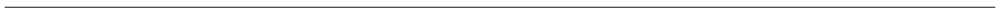

<p align="center"> </p>
<p align="center"> </p>
<p align="center"> </p>

<!-- ------------------------>
<!-- ------------------------>
# <a name="Contents"></a>Contents
<!-- ------------------------>
<!-- ------------------------>

- [Introduction](#Introduction)
- [Need](#Need)
- [Framework](#Framework)
- [Installation Guide](#InstallGuide)
- [Step-by-step walkthrough](#WalkThrough) 
    + [metis.readgcam](#metis.readgcam)
    + [mtis.chartsProcess](#metis.chartsProcess)
    + [mtis.boundaries](#metis.boundaries)
    + [mtis.grid2poly](#metis.grid2poly)
    + [metis.mapsProcess](#metis.mapsProcess)
    
  
<!-- ------------------------>
<!-- ------------------------>
# <a name="Introduction"></a>Introduction
<p align="center"> </p>
<!-- ------------------------>
<!-- ------------------------>

[Back to Contents](#Contents)

The Metis model is a joint effort by the Pacific Northwest National Laboratory (PNNL) and the University of Maryland (UMD). The name "Metis" is inspired by the the Greek Goddes of "good counsel, planning, cunning and wisdom". The overall goal of the Metis model is to develop a framework allowing analysis of dynamics across multiple sectors including water, energy, land and socio-economics at various spatial and temporal scales. The Metis model is designed to be a flexible tool to be used in conjunction with both global integrated assessment models (IAMs) which capture global dynamics as well as more detailed models which can capture specific sub-regional and sectoral details at finer resolutions. Metis integrates with these other tools by sharing data in standarized formats across the platforms and stakeholders. 

In most projects looking at multi-sector dynamics one of the key constraints is data availability and a key goal of Metis is to overcome this barrier by providing users with default data across sectors for their specific region. This default data comes from GCAM which operates at a relatively aggregated resolution when compared with sub-basins or states. The GCAM data is downscaled to 0.5 degree grids and offers users a first look at the water-energy-land situation in their regions of interest. The idea is to use this as a starting point and then improve the data as and when it becomes available while working with local stakeholders. The advantage of this system is that even without more precise local data the baseline data already permits users to review trends across the WEL nexus for various socio-economic and climate change pathways which will hold even if the underlying absolute data is adjusted.

<p align="center"> <b> Metis - A model to bridge the gap between coarse resolution IAMs and finer-resolution sector specific models </b> </p>
<p align="center"> </p>

- The Metis modeling development platform is hosted on github at: https://github.com/zarrarkhan/metis
- To clone this repo is: https://github.com/zarrarkhan/metis.git
- The model is comprised of an R package and additional files with sample data


<!-- ------------------------>
<!-- ------------------------>
# <a name="Need"></a>Need
<p align="center"> </p>
<!-- ------------------------>
<!-- ------------------------>

[Back to Contents](#Contents)

The motivation behind developing the Metis model is to bridge the gap between models working at different spatial and temporal resolutions. Sector specific details such as diurnal electricity demand profiles and the availability of intermittent technologies are often captured by fine resolution sector specific models. These finer scale models are however often limited in scope to the specific sector in question. With increasing pressures on limited resources from growing populations, technological advances and a changing climate the links across human-earth systems are becoming more critical. These links include feedbacks across system such as water demands for powerplant cooling and hydropower; energy demands for water purification, transfers and distribution; both energy and water demands for agriculture production and harvesting; and the impacts of land-use change emissions and water demands as a result of biofuel expansion and deforestation. All of these are driven by socio-economic developments and policy decisions across these systems. Global integrateed assessment models are often used to capture these broader longterm dynamics on larger spatial and temporal scales. The development of the Metis model will address this need to capture both broader long-term dynamcis across systems and global markets as well as sub-regional details. The model will do this by taking global data and dynamcis from an IAM such as GCAM and then downscale the results to relevant sub-regional boundaries based on the needs of local stakeholders. The downscaled data will then be refined and calibrated with local sector specific data. This will be followed by calibration of the local inter-sectoral links and the model will then be used for future sector specific policy analysis at the relevant scales while still including global dynamics.


<!-- ------------------------>
<!-- ------------------------>
# <a name="Framework"></a> Framework
<p align="center"> </p>
<!-- ------------------------>
<!-- ------------------------>

[Back to Contents](#Contents)

Metis is envisioned to be developed in several phases with progressively more detail while maintainging ease-of-use and accesibility to a range of stakeholders with varying expertise and comfort from different sectors. The long-term vision of metis is shown in the figure below. This first version of metis provides the basic tools for stakeholders to visualize and aggregate data up to the relevant area of interest. Version 2 of the model will focus on understanding the links between different sectors and sub-regions to allow analyis of cross-sector dynamics. In version 3 of the model, infrastructure options will be included to allow exploration of various investments options such electricity grid, road and pipeline expansion. Version 1 of the model is composed of three main modules: "GCAM", "Charting" and "Mapping" which serve as a multi-sector accounting tool to visualize and analyze demands, supplies and distribution of various resources across multiple sectors at flexible sub-regional scales. The modules are designed to be flexible and easy to use by multiple stakeholders with varying needs.  

<p align="center"> <b> Metis Long Term Vision</b> </p>
<p align="center"> </p>

<p align="center"> <b> Metis 1.0 Framework </b> </p>
<p align="center"> </p>


<!-- ------------------------>
<!-- ------------------------>
# <a name="InstallGuide"></a>Installation Guide
<p align="center"> </p>
<!-- ------------------------>
<!-- ------------------------>

[Back to Contents](#Contents)

1. Clone the repo from github:

```r
# Download a git software (eg. https://git-scm.com/downloads)
# Clone repo
git clone https://github.com/zarrarkhan/metis.git

# Or download from github https://github.com/zarrarkhan/metis 
```  

2. Download R studio (https://www.rstudio.com/) and R (https://www.r-project.org/)

3. Open the metis.Rproj file.

4. Open the "metis.master.R"" file which contains code to help install and run remaining model.

5. Install the necessary R packages including Metis.

```r
#----------------------------
# Install necessary packages
#----------------------------
if("devtools" %in% rownames(installed.packages()) == F){install.packages("devtools")}
library(devtools)
if("metis" %in% rownames(installed.packages()) == F){install_github(repo="zarrarkhan/metis")}
library(metis)
if("rgcam" %in% rownames(installed.packages()) == F){install_github(repo="JGCRI/rgcam")}
library(rgcam)
if("tibble" %in% rownames(installed.packages()) == F){install.packages("tibble")}
library(tibble)
if("dplyr" %in% rownames(installed.packages()) == F){install.packages("dlpyr")}
library(dplyr)
if("rgdal" %in% rownames(installed.packages()) == F){install.packages("rgdal")}
library(rgdal)
if("tmap" %in% rownames(installed.packages()) == F){install.packages("tmap")}
library(tmap)
```  

6. Download the relevant shapefiles (gis.zip) from Open Science Framework (OSF) at https://osf.io/pbta5/.
Save and unzip the file in ./metis/datafiles/gis.

7. After downloading and unzipping you should have the following folder structure with the following sub-folders in ./metis/datafiles:
- examples: Contains example shapefiles, as well as gridded and polygon data to work with
- gcam: Contains an example gcam run output
- gis: This is the unzipped osf folder (https://osf.io/pbta5/) and contains other shape files including sub-basins, gcam regions, gcam basins, naturalEarth boundaries and other country specific boundaries.
- mapping: This contains two files which are used to map color palettes and other parameters not provided by stakeholder tables.

<details><summary>Click here to expand for further details, code and example figures.</summary>
<p>

<p align="center"> <b> Metis Initial Folders </b> </p>
<p align="center"> </p>

</p>
</details>


<!-- ------------------------>
<!-- ------------------------>
# <a name="WalkThrough"></a> Step-by-step Walkthrough
<p align="center"> </p>
<!-- ------------------------>
<!-- ------------------------>

[Back to Contents](#Contents)

This section walks through the different features of the metis package using the example data provided in order to familiarize the user with the different functions. All metis R functions are stored in ./metis/R. In Metis version 1.0.0 the following functions are available:

- metis.assumptions.R: Contains all conversions and assumptions used in the model
- metis.chart.R: metis charting function which allows quick and easy access to features like facets, labels and colors. The function is based on ggplot and returns a ggplot chart.
- metis.chartsProcess.R: metis charting function used to compare scenarios and regions. The function also creates diff plots with percentage and absolute differences from a given reference scenario.
- metis.colors.R: Collection of metis color palettes. A list of palettes can be viewed in the function help file (?metis.colors). To view a particular palette metis.colors("pal_hot")
- metis.grid2poly.R: Function used to crop and aggregate gridded data by a given polygon shape file. If no grid is provided the function can still be used to produce regional and subregional maps.
- metis.map.R: metis mapping function to plot raster and polygon data. The function uses the tmap package and returns a tmap object. Several maps can be combined by overlaying and underlaying using this function. Options allow for different colors palettes, labels, text-size as well as legend breaks which are freescale, kmeans or equally divided to highlight different kinds of data.
- metis.mapsProcess.R: metis mapping function used to compare across scenarios. The function produces diff maps with percentage and absolute differences from a given reference scenario.
- metis.prepGrid.R: This function is designed to be used with specific open-source downscaling models Xanthos, Demeter and Tethys which downscale GCAM data to the grid level. The function takes outputs from these various models and processes them into the metis format which is then used as an input to the metis.mapsProcess.R function.
- metis.R: Function to define package documentation.
- metis.readgcam.R: This functions is designed to interact specifically with GCAM outputs. The function processes GCAM outputs into .csv files by GCAM region which can then be used as inputs to metis.chartsProcess.R
- metis.templates.R: Templates which define the overall look and feel of metis charts. The templates file also contains the metis figure printing function allowin a choice between pdf and png files. 

<details><summary>Click here to expand for further details, code and example figures.</summary>
<p>

<p align="center"> <b> Metis Functions </b> </p>
<p align="center"> </p>


The workflow for data processing, charting and mapping is shown below. The following subsections will guide the user through each of these processes further expaning on the functionality within each of the functions.

<p align="center"> <b> Metis chart and mapping processes </b> </p>
<p align="center"> </p>

</p>
</details>


<!-- ------------------------>
<!-- ------------------------>
## <a name="metis.readgcam"></a> metis.readgcam
<p align="center"> </p>
<!-- ------------------------>
<!-- ------------------------>

[Back to Contents](#Contents)


<b> Key Inputs </b>  

- GCAM data: A gcamdatabase OR a gcamdata ".proj"" file (with complete paths)
- Query File: An ".xml" query file (with complete paths)


The model comes with an example gcamdatabase ".proj" file called "Example_dataProj.proj" which lies in the folder metis/dataFiles/gcam/ as shown in the figure below. It is recommended that other gcamdatabases are also kept in this folder. GCAM produces an output in the form of a database. The database contains outputs from various scenario runs. "metis.readgcam" uses another package "rgcam" to connects with the gcam database and retrieves data based on "queries" provided in an ".xml" file. Often scenario names in the model can be long and not appropriate for final figures. This function allows you to rename the scenarios as they are read in. Once the data has been extracted from a gcam database it is saved in a ".proj" file. Reading data from the gcam database can take a considerable amount of time depending on the number of scenarios it contains. The "metis.readgcam" function gives the option of directly providing a ".proj" which can be loaded directly or using the ".proj" file from a previous run by setting the parameter "reReadData" to FALSE. If "reReadData" is set to FALSE the function will first search for a user provided ".proj" file (which is entered in the param "dataProj"), then in the "inputs/gcam" folder and if it doesn't exist will give an error message. If "reReadData" is set to TRUE then the function will create a file called "dataProj.proj" in the same folder as the GCAM database. The code below shows how to read in data using the database or .proj file. The user can choose the regions of interest.

<details><summary>Click here to expand for further details, code and example figures.</summary>
<p>

<p align="center"> <b> GCAM data </b> </p>
<p align="center"> </p>


```r
#----------------------------
# Read GCAM Data
#---------------------------

gcamdatabasePath <-paste(getwd(),"/dataFiles/gcam",sep="")
gcamdatabaseName <-"example_database_basexdb"
gcamdataProjFile <-"Example_dataProj.proj"
regionsSelect <- c("Colombia","Argentina")
# Choose Parameters or set to "All" for all params. For complete list see ?metis.readgcam
paramsSelect=c("finalNrgbySec", "primNrgConsumByFuel", "elecByTech",
               "watConsumBySec", "watWithdrawBySec","gdp", "gdpGrowthRate", "pop",
               "agProdByCrop", "aggLandAlloc","co2emissionByEndUse")

# Use function localDBConn from package rgcam to get a list of scenarios if needed.
# localDBConn(gcamdatabasePath,gcamdatabaseName)
# dataProjLoaded <- loadProject(paste(gcamdatabasePath, "/", dataProj, sep = ""))
#  listScenarios(dataProjLoaded)  # List of Scenarios in GCAM database
# queries <- listQueries(dataProjLoaded)  # List of Queries in queryxml


dataGCAM<-metis.readgcam(reReadData=F, # Default Value is T
                       dataProj=gcamdataProjFile, # Default Value is "dataProj.proj"
                       scenOrigNames=c("ExampleScen1","ExampleScen2"),
                       scenNewNames=c("Eg1","Eg2"),
                       gcamdatabasePath=gcamdatabasePath,
                       gcamdatabaseName=gcamdatabaseName,
                       queryxml="metisQueries.xml",  # Default Value is "metisQueries.xml"
                       dirOutputs= paste(getwd(),"/outputs",sep=""), # Default Value is paste(getwd(),"/outputs",sep="")
                       regionsSelect=regionsSelect, # Default Value is NULL
                       paramsSelect=paramsSelect, # Default value is "All"
                       queriesSelect="All" # Default is "All"
                       )

dataGCAM$data # To view the data read that was read.
                       
```  

The function metis.readgcam() returns a list which contains a dataframe with the values it read from the database. In this case it is saved in the variable dataGCAM. The function also creates a new folder "outputs" and stores GCAM data tables in this folder. The function will save the data as a .csv file for each region and one .csv for all regions. Tables with "aggClass" aggregate data across classes to provided sector summaries. In addition the function will produce an empty template data table for each region to be shared with local stakeholders so they can fill in their data. If not specified then all these tables will by default go to a folder called ./metis/outputs/readGCAMTables as shown in the figure below. Once the empty template tables are filled with appropriate local data these can be saved in the folder outputs/Tables/Tables_Local. 

<p align="center"> <b> GCAM data tables</b> </p>
<p align="center"> </p>


</p>
</details>

<!-- ------------------------>
<!-- ------------------------>
## <a name="metis.chartsProcess"></a> metis.chartsProcess
<p align="center"> </p>
<!-- ------------------------>
<!-- ------------------------>

[Back to Contents](#Contents)

<b> Key Inputs </b>  

- rTable: An rTable which can be the output of metis.readgcam() OR/AND
- dataTable: A .csv table which can be the original or modified tables produced by metis.readgcam
- (Optional) paramsSelect: A subset of the parameters read using the query file. 
- (Optional) regionsSelect: A subset of the regions available in the data.
- (Optional) scenRef: Select a scenario which will be used as a reference to compare differences with other scenarios.


After running metis.chartsProcess several charts will be produced. These will be saved in separate folders for each region and then within each there will be a folder for each scenario as well as a folder for cross-scenario comparisons. The folder paths are shown in the figure below. In addition to the individual regional folders a folder called compareRegions will contain inter-regional comparisons for each scenario as well as a cross-region/cross-scenario comparison.
Tables with the data used for each figure will also be provided in ./metis/outputs/Charts.


<details><summary>Click here to expand for further details, code and example figures.</summary>
<p>

```r
#----------------------------
# Produce Data Charts
#---------------------------

# Read in Tables (If exist)
# To test can create a copy of the template in ./readGCAMTables/Tables_Templates/template_Regional_Argentina.csv
# in ./readGCAMTables/Tables_Local/ and rename the file something like "local_Regional_Argentina.csv.
# dataTables<-c(paste(getwd(),"/outputs/readGCAMTables/Tables_Local/local_Regional_Argentina.csv",sep=""))  # Need to create this before loading

# Read in the data from the function metis.readgcam
rTable <- dataGCAM$data;

# Choose Parameters or set to "All" for all params. For complete list see ?metis.chartsProcess
paramsSelect=c("elecByTech","gdp")


regionsSelect=c("Argentina","Colombia")

charts<-metis.chartsProcess(rTable=rTable, # Default is NULL
                          #dataTables=dataTables, # Default is NULL
                          paramsSelect=paramsSelect, # Default is "All"
                          regionsSelect=regionsSelect, # Default is "All"
                          xCompare=c("2015","2035","2050","2100"), # Default is c("2015","2030","2050","2100")
                          scenRef="Eg1", # Default is NULL
                          dirOutputs=paste(getwd(),"/outputs",sep=""), # Default is paste(getwd(),"/outputs",sep="")
                          pdfpng="png", # Default is "png"
                          regionCompareOnly=0 # Default is "0"
                          )

```

<p align="center"> <b> metis.chartsProcess Outputs and Example Charts </b> </p>
<p align="center"> </p>

<p align="center"> </p>

</p>
</details>

<!-- ------------------------>
<!-- ------------------------>
## <a name="metis.boundaries"></a> metis.boundaries
<p align="center"> </p>
<!-- ------------------------>
<!-- ------------------------>


[Back to Contents](#Contents)

<b> Key Inputs </b>  

- boundaryRegShape: A polygon shapefile which has already been read into R defining the boundary region. Default is NULL. If left NULL then a folder and filename should be specified if a boundary is desired.
- boundaryRegShpFolder: If an extended map is desired then this can be provided. naturalEarth admin boundaries are available if downloaded from the osf link https://osf.io/pbta5/). These will be lying in ./metis/dataFiles/gis/naturalEarth, The default value is NULL and in this case no extended boundary will be drawn.
- boundaryRegShpFile: If desired and chosen from the naturalEarth data then "ne_10m_admin_0_countries" can be chosen.
- boundaryRegCol: If boundaryRegShpFolder and File are specified then this column should be specified. If the naturalEarth data is used the column is "NAME".
- boundaryRegionsSelect: Desired boundary region. In the naturalEarth data these are country names eg. "Argentina",
- subRegShape: A polygon shapefile which has already been read into R defining the subregion boundaries. Default is NULL. If left NULL then a folder and filename should be specified.
- subRegShpFolder: Folder where subregion shapefile is saved. 
- subRegShpFile: Name of subregion shapefile.
- subRegCol: Column name in shape data which defines the different sub-regions. The sub-region shape file should be read and this column name should be checked.
- (Optional) subRegionsSelect: If desired the subregion polygons can be subset by the sub-regions specified here.
- subRegType: The kind of sub-region being analyzed e.g. "state", "subBasin" etc. 
- nameAppend: If any name should be appended to the files produced e.g. "_hydrobidBermeo3",
- extension: If the extended boundary region should be plotted with the subregion.
- overlapShpFolder: If an overlapping shapefile is desired then the folder should be specified. For example GCAM basin boundaries saved in ./metis/dataFiles/gis/basin_gcam
- overlapShpFile: Overlapping shapefile name for eg. "Global235_CLM_final_5arcmin_multipart"

metis.boundaries is used to create maps showing where the sub-region lies in the greater region. For this option a boundary region should be defined. NaturalEarth boundary region files have been made available throught the osf repository https://osf.io/pbta5/). Once metis.boundaries has been run a folder for "Maps" is created. The Maps folder will contain a "Boundary" folder which contains the boundary files defining each region and subregion. The function also shows how different grid cells sizes compare with the selected regions. This is useful to understand if the desired regional resolution is too fine for a particular grid size. The folder structure and example output boundary maps are shown in the figures that follow.

<details><summary>Click here to expand for further details, code and example figures.</summary>
<p>

```r
#-----------
# Boundaries
#-------------

# Example Shape File
examplePolyFolder<-paste(getwd(),"/dataFiles/examples",sep="")
examplePolyFile<-paste("bermejo3Cropped",sep="")
bermejo3Cropped=readOGR(dsn=examplePolyFolder,
                        layer=examplePolyFile,use_iconv=T,encoding='UTF-8')
head(bermejo3Cropped@data)
metis.map(dataPolygon=bermejo3Cropped,fillColumn = "SUB_NAME",labels=T ,printFig=F,facetsON=F)


bermejoBoundaries<- metis.boundaries(
                            boundaryRegShape=NULL,
                            boundaryRegShpFolder=paste(getwd(),"/dataFiles/gis/naturalEarth",sep=""),
                            boundaryRegShpFile=paste("ne_10m_admin_0_countries",sep=""),
                            boundaryRegCol="NAME",
                            boundaryRegionsSelect="Argentina",
                            subRegShape=bermejo3Cropped,
                            subRegCol="SUB_NAME",
                            subRegType="subRegType",
                            nameAppend="_test",
                            expandPercent=2,
                            overlapShpFile="Global235_CLM_final_5arcmin_multipart",
                            overlapShpFolder=paste(getwd(),"/dataFiles/gis/basin_gcam",sep=""),
                            extension = T,
                            grids = c(paste(getwd(),"/dataFiles/grids/emptyGrids/grid_025.csv",sep=""),
                                      paste(getwd(),"/dataFiles/grids/emptyGrids/grid_050.csv",sep=""))
                            )

```

<p align="center"> <b> metis.boundaries Outputs and Example Charts </b> </p>
<p align="center"> </p>
<p align="center"> </p>

</p>
</details>

<!-- ------------------------>
<!-- ------------------------>
## <a name="metis.grid2poly"></a> metis.grid2poly
<p align="center"> </p>
<!-- ------------------------>
<!-- ------------------------>

[Back to Contents](#Contents)

<b> Key Inputs </b>  

- grid: Grid file with lat and lon coordinates. 
- boundaryRegionsSelect: Name of general region. The model will create a folder for each region.
- (Optional) subRegShape: A polygon shapefile which has already been read into R defining the subregion boundaries. Default is NULL. If left NULL then a folder and filename should be specified.
- subRegShpFolder: Folder where subregion shapefile is saved.
- subRegShpFile: Name of subregion shapefile.  If desired and chosen from the naturalEarth data then "ne_10m_admin_1_states_provinces" can be chosen.
- subRegCol: Column name in shape data which defines the different sub-regions. The sub-region shape file should be read and this column name should be checked. For the "ne_10m_admin_1_states_provinces" data this name will be "name"
- (Optional) subRegionsSelect: If desired the subregion polygons can be subset by the sub-regions specified here.
- subRegType: The kind of sub-region being analyzed e.g. "state", "subBasin" etc. 


metis.grid2poly is used to aggregate gridded data to given sub-regional spatial scales. Depending on the type of gridded data (volume or depth) the aggregation is done based on the part of the polygon which intersect with the grid cells as shown in the figure below. 

metis.grid2poly can also be used to create maps showing where the sub-region lies in the greater region. For this option a boundary region should be defined. naturalEarth boundary region files have been made available throught the osf repository https://osf.io/pbta5/). Once grid2poly has been run a folder for "Maps" and a folder for "Grids" (if a grid file was provided) are created. Within the Maps folder (./metis/outputs/Maps) the user will find a Tables folder which contains all the data used to create the map as a well as a template for stakeholders to input their own data as a new scenario by sub-region. The Maps folder will also contain a "Boundary" folder which contains the boundary files defining each region and subregion and also includes shapefiles incase these need to be shared with others. The folder structure and example output boundary maps are shown in the figures that follow. If a grid has been provided then a "Grid" folder is also created which contains the cropped gridded data which can be used in for mapping.

<details><summary>Click here to expand for further details, code and example figures.</summary>
<p>

```r
#-----------
# Grid to Poly
#-------------

# Example Grid File
gridExample<-paste(getwd(),"/dataFiles/examples/example_grid_ArgentinaBermejo3_Eg1Eg2.csv",sep="")

# Run metis.grid2poly
polyBermeo3Cropped<-metis.grid2poly(grid=gridExample,
                                    boundaryRegionsSelect="Argentina",
                                    subRegShpFolder=examplePolyFolder,
                                    subRegShpFile=examplePolyFile,
                                    subRegCol="SUB_NAME",
                                    #aggType=NULL,
                                    nameAppend="_hydrobidBermeo3")

```

<p align="center"> <b> metis.grid2poly Outputs and Example Charts </b> </p>
<p align="center"> </p>

<p align="center"> <b> metis.grid2poly metis.grid2poly conceptual aggregation methods  </b> </p>
<p align="center"> </p>


</p>
</details>

<!-- ------------------------>
<!-- ------------------------>
## <a name="metis.mapsProcess"></a> metis.mapsProcess
<p align="center"> </p>
<!-- ------------------------>
<!-- ------------------------>

[Back to Contents](#Contents)

<b> Key Inputs </b>  

- polygonDataTables: Data table with data per sub-region. This can be an individual table or outputs from metis.grid2poly. The individual table cna be built from the template provided by metis.grid2poly. 
- gridDataTables: This is gridded data whith lat, lon and values. The outputs from metis.grid2poly can be used or the output can be used as a template to populates user data.
- xRange=c(2005,2010,2020): Range of years to analyze. If left blank will analyze all available years.
- boundaryRegionsSelect: Name of overall region. Will create a folder with this name. "Argentina",
- (Optional) subRegShape: If a subregional shape is already available in R. If not then the shape folder and file need to be specified in the following paramters. 
- subRegShpFolder: Sub-region shape file folder. This can be an output of metis.grid2poly and will be lying in ./metis/outputs/Maps/Boundary/"REGIONX". It can also be a subregion from the downloaded gis files E.g. paste(getwd(),"/dataFiles/gis/subbasin_hydrobid",sep=""),
- subRegShpFile: Sub-region shapefile name e.g. paste("bermejo3Cropped",sep=""),
- subRegCol: Columns whith unique identifiers for each sub-region. In this case e.g. "SUB_NAME". The shapefile data should be read and checked to determine this. 
- subRegType: Name the type of sub-region being analyzed. A separate folder for each type will be create. For exampel "subBasin" or "state"
- nameAppend: Any additional names to append to files.
- legendPosition: Legend position for freescale maps. Since different shapes may warrant different legend positions. Default is =c("RIGHT","top").
- scenRef: The reference scenario name. All other scenarios will use this as the base for diff maps.


After running metis.mapsProcess additional folders are created in the ./metis/outputs/Maps/ folder for each region and sub-region indicated. Within each of these there are plots for each scenario as well as diff plots showing the absolute and percentage difference between the selected reference scenario and all other scenarios. Each map is produced with three kinds of legends Freescale, Kmeans and pretty (or equal breaks) which allow the user to analyze different kinds of data. THe colors schemes for the plots are determined in metis.colors and can be adjusted by advanced users. Animations showing changes through the years are also created for each type of map and legend type. Example of the folder structure and ouputs from metis.mapsProcess are shown below.

<details><summary>Click here to expand for further details, code and example figures.</summary>
<p>


```r
#-----------
# Mapping
#-------------

exampleGridTable<-paste(getwd(),"/dataFiles/examples/example_grid_ArgentinaBermejo3_Eg1Eg2.csv",sep="")
examplePolygonTable<-paste(getwd(),"/dataFiles/examples/example_poly_ArgentinaBermejo3_Eg1Eg2.csv",sep="")

metis.mapProcess(polygonDataTables=examplePolygonTable,
                 gridDataTables=exampleGridTable,
                 xRange=c(2005,2010,2020),
                 boundaryRegionsSelect="Argentina",
                 subRegShape=NULL,
                 subRegShpFolder=paste(getwd(),"/dataFiles/gis/subbasin_hydrobid",sep=""),
                 subRegShpFile=paste("Argentina_Subregion_subBasin_hydrobidBermeo3",sep=""),
                 subRegCol="SUB_NAME",
                 subRegType="subBasin",
                 nameAppend="_hydrobid",
                 legendPosition=c("RIGHT","top"),
                 animateOn=T,
                 delay=100,
                 scenRef="Eg1")

```

<p align="center"> <b> metis.mapsProcess Outputs Folders </b> </p>
<p align="center"> </p>


<p align="center"> <b> metis.mapsProcess Example Output Data Scales </b> </p>
<p align="center"> </p>


<p align="center"> <b> metis.mapsProcess Example Outputs Spatial Scales </b> </p>

Grid |  State
:-------------------------:|:-------------------------:
  |    

Grid |  Basin 
:-------------------------:|:-------------------------:
  |    


</p>
</details>

<p align="center"> </p>

[Back to Contents](#Contents)
