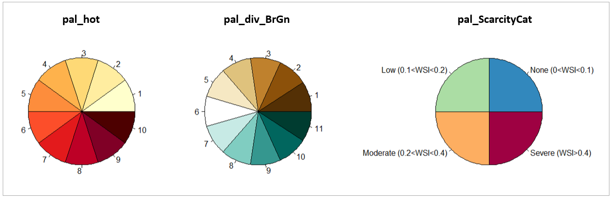

<!-------------------------->
<!-------------------------->
# Key Links
<p align="center"> </p>
<!-------------------------->
<!-------------------------->

- Github: https://github.com/JGCRI/metis
- Webpage: https://jgcri.github.io/metis/
- Cheatsheet: https://github.com/JGCRI/metis/blob/master/metisCheatsheet.pdf


<!-------------------------->
<!-------------------------->
# Color Palettes
<p align="center"> </p>
<!-------------------------->
<!-------------------------->

-	pal_metis
-	pal_16
-	al_seq
-	pal_Basic
-	pal_hot
-	pal_green
-	pal_wet
-	pal_div_wet
-	pal_div_RdBl
-	pal_div_BlRd
-	pal_div_GnBr
-	pal_div_BrGn
-	pal_div_BluRd
-	pal_div_RdBlu
-	pal_sankey
-	pal_spectral
-	pal_ScarcityCat


The following commands can be used to view the list of metis palettes as well as to visualize a particular palette and get a list of its colors:

```{r, eval=F}
library(metis)

names(metis.colors()) # View all palettes
metis.colors("pal_hot")
metis.colors("pal_div_BrGn")
metis.colors("pal_ScarcityCat")

```  

<p align="center" style="font-size:18px;"> *Color Palettes* </p>
<p align="center"> </p>


<!-------------------------->
<!-------------------------->
# Maps
<p align="center"> </p>
<!-------------------------->
<!-------------------------->

- mapCountries:                           World Map of Countries
- mapCountriesUS52:                       Merge of Countries and US52
- mapGCAMBasins:                          GCAM Basins
- mapGCAMBasinsUS49:                      Cropped of GCAM Basins and US49
- mapGCAMBasinsUS52:                      Cropped of GCAM Basins and US52
- mapGCAMLand:                            GCAM Land
- mapGCAMLandUS49:                        GCAM Land cropped to US49
- mapGCAMLandUS52:                        GCAM Land cropped to US52
- mapGCAMReg32:                           GCAM 32 Regions
- mapGCAMReg32US52:                       Merge of GCAM 32 and US52
- mapHydroShed1:                          HydroSHEDS level 1
- mapHydroShed2:                          HydroSHEDS level 2
- mapHydroShed3:                          HydroSHEDS level 3
- mapIntersectGCAMBasin32Reg:             Intersection of GCAM Basins and GCAM 32 Regions.
- mapIntersectGCAMBasinCountry:           Intersection of GCAM Basins and countries.
- mapStates:                              World Map of States
- mapUS49:                                US 49 States Excludes Alaska, Hawaii and Puerto Rico. Includes DC.
- mapUS49County:                          US 49 States Excludes Alaska, Hawaii and Puerto Rico. Includes DC.
- mapUS49HUC2:                            USGS Hydrological Unit Code (HUC)
- mapUS49HUC4:                            USGS Hydrological Unit Code (HUC)
- mapUS52:                                US 52 States Includes Alaska, Hawaii and Puerto Rico as well as DC.
- mapUS52County:                          US 52 Counties Includes Alaska, Hawaii and Puerto Rico as well as DC.
- mapUS52Compact:                                US 52 States with Alaska, Hawaii and Puerto Rico repositioned for compact US map.
- mapUS52CountyCompact:                          US 52 Counties with Alaska, Hawaii and Puerto Rico repositioned for compact US County map.
- mapUS52HUC2:                            USGS Hydrological Unit Code (HUC)
- mapUS52HUC4:                            USGS Hydrological Unit Code (HUC)

The following commands can be used to view a particular map and the data contained in the shape file:


```{r, eval=F}
library(metis)

head(mapUS49@data) # To View data in shapefile
metis::metis.map(mapUS49, labels=T)

```

<p align="center" style="font-size:18px;"> *Example View of Pre-loaded Map for US49* </p>
<p align="center"> </p>

<!-------------------------->
<!-------------------------->
# Params
<p align="center"> </p>
<!-------------------------->
<!-------------------------->

The following command will provide an updated list of params and paramSets to be used in [metis.readgcam](https://jgcri.github.io/metis/articles/vignette_metis.readgcam.html).

```{r, eval=F}
library(metis); library(dplyr)

metis.mappings()$mapParamQuery%>%dplyr::select(-query,-mapPalette)

```

<p align="center" style="font-size:18px;"> *List of key Params for readGCAM* </p>
<p align="center"> </p>

