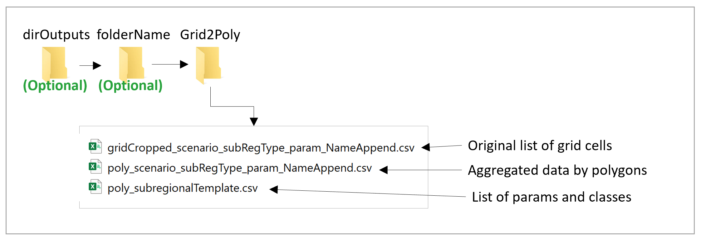
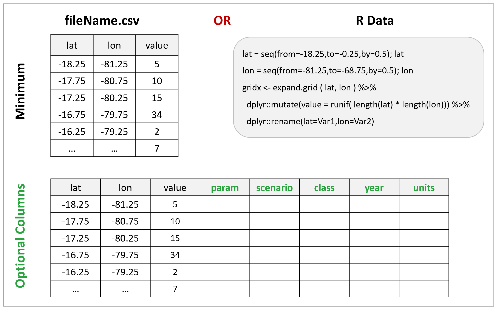
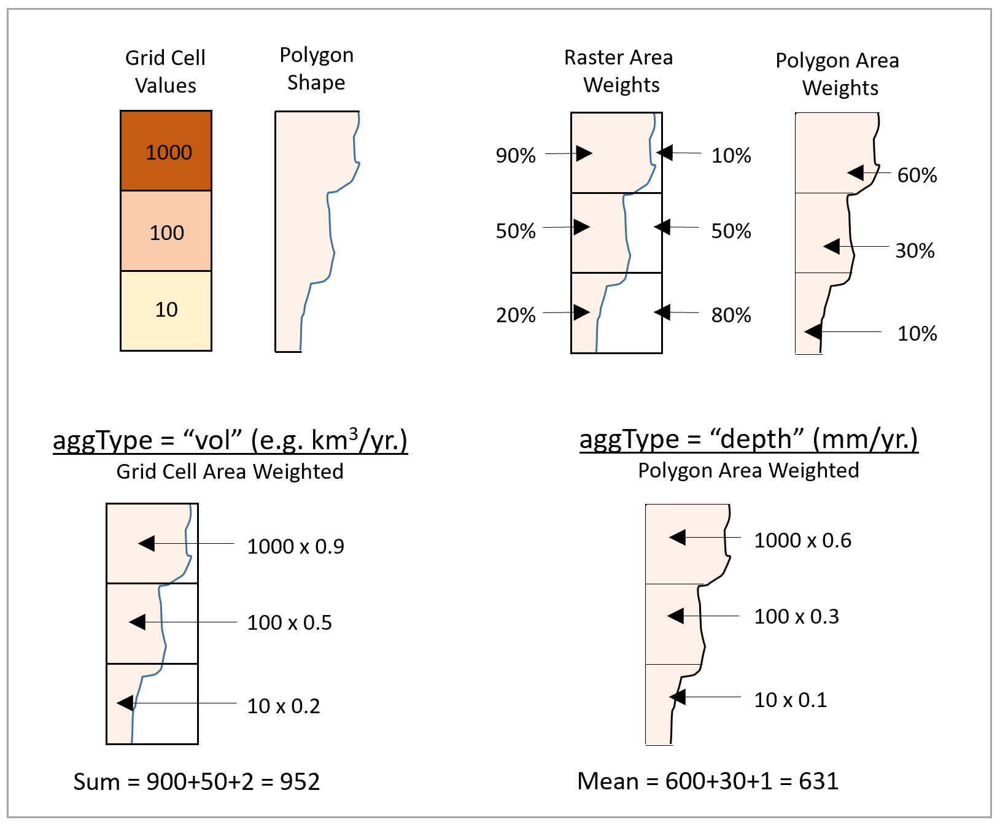

<!-------------------------->
<!-------------------------->
# Key Links
<p align="center"> </p>
<!-------------------------->
<!-------------------------->

- Github: https://github.com/JGCRI/metis
- Webpage: https://jgcri.github.io/metis/
- Cheatsheet: https://github.com/JGCRI/metis/blob/master/metisCheatsheet.pdf

<!-------------------------->
<!-------------------------->
# Folder Structure & Inputs
<p align="center"> </p>
<!-------------------------->
<!-------------------------->

<p align="center" style="font-size:18px;"> *Folder structure* </p>
<p align="center"> </p>

<p align="center" style="font-size:18px;"> *Key inputs* </p>
<p align="center"> </p>

<!-------------------------->
<!-------------------------->
# Aggregation Methodology
<p align="center"> </p>
<!-------------------------->
<!-------------------------->

<p align="center" style="font-size:18px;"> *Aggregation Methodology* </p>
<p align="center"> </p>

<!-------------------------->
<!-------------------------->
# Grid to Poly Example
<p align="center"> </p>
<!-------------------------->
<!-------------------------->

If data is in multiple columns please convert to the long format and label the different categories in the "class" column as shown in the example below for the "value1" and "value2" columns.

```{r, eval=F}
library(metis); library(tidyr)

# Generate example grid data for Peru (lat from -18.25 to -0.25, lon from -81.25 to -68.75)
lat = seq(from=-18.25,to=-0.25,by=0.5); lat
lon = seq(from=-81.25,to=-68.75,by=0.5); lon
gridx <- expand.grid(lat,lon) %>%
  dplyr::mutate(value1=runif(length(lat)*length(lon)),
                value2=runif(length(lat)*length(lon))) %>%
  dplyr::rename(lat=Var1,lon=Var2); gridx%>%head()

# Switch data to long format with columns: lat, lon, class, value 
# Other optional columns (scenario, param, x or year)
# All other columns will be treated as characters
gridx <- gridx %>%
  tidyr::gather(key="class",value="value",-lat,-lon); gridx %>% head()

# Shape: Peru States
shapex <- metis::mapStates
shapex <- shapex[shapex@data$region %in% c("Peru"),]
shapex@data <- droplevels(shapex@data)
metis.map(shapex)

# Run metis.grid2poly
grid2PolyVol<-metis.grid2poly(gridFiles=gridx,
                                  subRegShape=shapex,
                                  aggType = "vol",
                                  subRegCol="subRegion",
                                  nameAppend="_examplePeruVol",
                                  folderName="vignetteGrid2Poly")

grid2PolyDepth<-metis.grid2poly(gridFiles=gridx,
                              subRegShape=shapex,
                              aggType = "depth",
                              subRegCol="subRegion",
                              nameAppend="_examplePeruDepth",
                              folderName="vignetteGrid2Poly")
```
