<!-------------------------->
<!-------------------------->
# Key Links
<p align="center"> </p>
<!-------------------------->
<!-------------------------->

- Github: https://github.com/JGCRI/metis
- Webpage: https://jgcri.github.io/metis/
- Cheatsheet: https://github.com/JGCRI/metis/blob/master/metisCheatsheet.pdf

<!-------------------------->
<!-------------------------->
# Folder Structure & Inputs
<p align="center"> </p>
<!-------------------------->
<!-------------------------->

<p align="center" style="font-size:18px;"> *Folder structure* </p>
<p align="center"> </p>

<p align="center" style="font-size:18px;"> *Key inputs* </p>
<p align="center"> </p>


<!-------------------------->
<!-------------------------->
# Maps Available
<p align="center"> </p>
<!-------------------------->
<!-------------------------->

Metis comes with a set of preloaded maps. A full list of metis maps is available at [colors, maps and params](https://jgcri.github.io/metis/articles/vignette_colorsMapsParams/#maps-1.html). The pre-loaded maps all come with each polygon labelled in a **subRegion** column. For each map the data contained in the shapefile and the map itself can be viewed as follows:

```{r, eval=F}
library(metis)

head(mapUS49@data) # To View data in shapefile
metis::metis.map(mapUS49, labels=T)

```

<p align="center" style="font-size:18px;"> *Example View of Pre-loaded Map for US49* </p>
<p align="center"> </p>


<!-------------------------->
<!-------------------------->
# Plot Data on Maps
<p align="center"> </p>
<!-------------------------->
<!-------------------------->

## Auto Map Find

`metis.mapsProcess` will search through the list of [pre-loaded metis maps](https://jgcri.github.io/metis/articles/vignette_colorsMapsParams.html) to see if it can find the "subRegions" provided in the data and then plot the data on those maps. Some examples are provided below:

### US 49

```{r, eval=F}
library(metis)

data = data.frame(subRegion=c("CA","FL","ID","MO","TX","WY"),
                  x=c(2050,2050,2050,2050,2050,2050),
                  value=c(5,10,15,34,2,7))
metis.mapsProcess(polygonTable=data,
                  folderName = "vignetteMaps", mapTitleOn = F)
```

<p align="center" style="font-size:18px;"> *US49* </p>
<p align="center"> 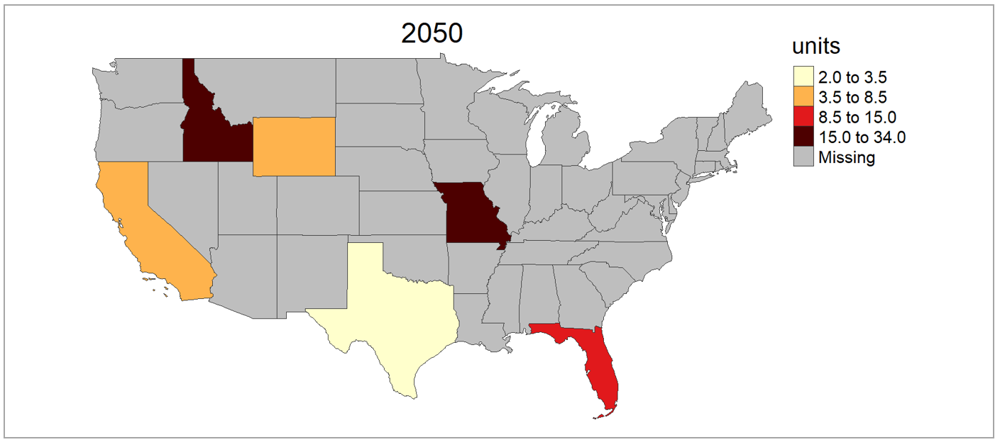</p>

<p align="center" style="font-size:18px;"> *US49 Outputs structure* </p>
<p align="center"> 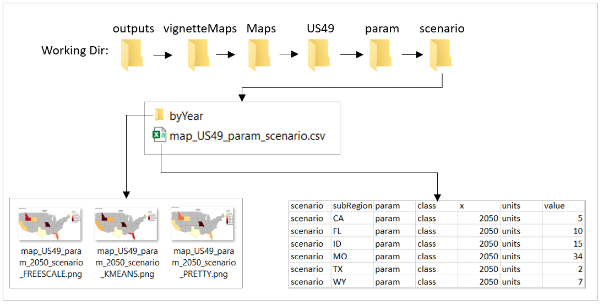</p>


### US 52

```{r, eval=F}
library(metis)

data = data.frame(subRegion=c("AK","FL","ID","MO","TX","WY"),
                  x=c(2050,2050,2050,2050,2050,2050),
                  value=c(5,10,15,34,2,7))
metis.mapsProcess(polygonTable=data,
                  folderName = "vignetteMaps", mapTitleOn = F)
```


<p align="center" style="font-size:18px;"> *US52* </p>
<p align="center"> </p>

### US 49 Counties

```{r, eval=F}
library(metis)

unique(mapUS49County@data$subRegion) # Check subRegion Names
unique(mapUS49County@data$subRegionAlt) # Check Alternate names
data = data.frame(subRegion=c("Pender_NC","Larue_KY","Jim Wells_TX","Orange_IN","Putnam_FL","Ellis_KS"),
                  x=c(2050,2050,2050,2050,2050,2050),
                  value=c(5,10,15,34,2,7))
metis.mapsProcess(polygonTable=data,
                  folderName = "vignetteMaps",
                  nameAppend = "_Alt",
                  mapTitleOn = F)
```


<p align="center" style="font-size:18px;"> *US49 Counties* </p>
<p align="center"> </p>

### US 52 Counties

```{r, eval=F}
library(metis)

unique(mapUS52County@data$subRegion) # Check subRegion Names
unique(mapUS52County@data$subRegionAlt) # Check Alternate names
data = data.frame(subRegion=c("Aleutians West_AK","Sabana Grande_PR","Kalawao_HI","Orange_IN","Putnam_FL","Ellis_KS"),
                  x=c(2050,2050,2050,2050,2050,2050),
                  value=c(5,10,15,34,2,7))
metis.mapsProcess(polygonTable=data,
                  folderName = "vignetteMaps",
                  nameAppend = "_Alt",
                  mapTitleOn = F)
```


<p align="center" style="font-size:18px;"> *US52 Counties* </p>
<p align="center"> </p>

### GCAM 32 Regions


```{r, eval=F}
library(metis)

unique(mapGCAMBasins@data$subRegion) # Check Available Regions
data = data.frame(subRegion=c("Colombia","China","EU-12","Pakistan","Middle East","Japan"),
                  x=c(2050,2050,2050,2050,2050,2050),
                  value=c(5,10,15,34,2,7))
metis.mapsProcess(polygonTable=data,
                  folderName = "vignetteMaps",
                  mapTitleOn = F)
```

<p align="center" style="font-size:18px;"> *GCAM 32 Regions* </p>
<p align="center"> 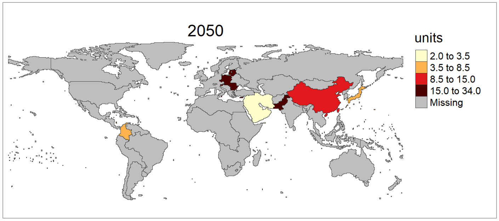</p>

### GCAM Basins

```{r, eval=F}
library(metis)

unique(mapGCAMBasins@data$subRegion) # Check Available Regions
data = data.frame(subRegion=c("Negro","La_plata","Great","New_England","Indus","Zambezi"),
                  x=c(2050,2050,2050,2050,2050,2050),
                  value=c(5,10,15,34,2,7))
metis.mapsProcess(polygonTable=data,
                  folderName = "vignetteMaps",
                  mapTitleOn = F)
```

<p align="center" style="font-size:18px;"> *GCAM Basins* </p>
<p align="center"> 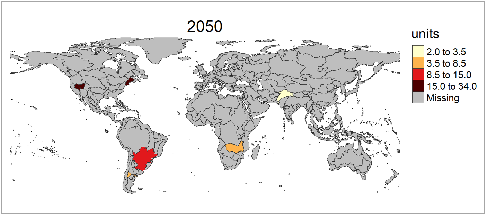</p>


### World Countries


```{r, eval=F}
library(metis)

unique(mapCountries@data$subRegion) # Check Available Regions
data = data.frame(subRegion=c("Colombia","China","India","Spain","Ghana","Iran"),
                  x=c(2050,2050,2050,2050,2050,2050),
                  value=c(5,10,15,34,2,7))
metis.mapsProcess(polygonTable=data,
                  folderName = "vignetteMaps",
                  mapTitleOn = F)
```

<p align="center" style="font-size:18px;"> *World Countries* </p>
<p align="center"> 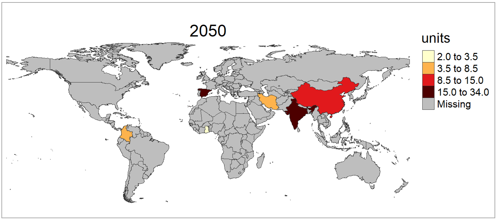</p>

### World States


```{r, eval=F}
library(metis)

unique(mapStates@data$subRegion) # Check Available Regions
data = data.frame(subRegion=c("Punjab","FL","TX","Faryab","Assam","Lac"),
                  x=c(2050,2050,2050,2050,2050,2050),
                  value=c(5,10,15,34,2,7))
metis.mapsProcess(polygonTable=data,
                  folderName = "vignetteMaps",
                  mapTitleOn = F)
```

<p align="center" style="font-size:18px;"> *World States* </p>
<p align="center"> </p>


## Select Map

Sometimes subRegions can be present on multiple maps. For example "Colombia", China" and "India" are all members of `metis::mapGCAMReg32` as well as `metis::mapCountries`. If a user knows which map they want to plot their data on they should specify the map in the `subRegShape` argument.


```{r, eval=F}
library(metis)

data = data.frame(subRegion=c("Colombia","China","India"),
                  x=c(2050,2050,2050),
                  value=c(5,10,15))

# Auto selection by metis will choose metis::mapCountries
metis.mapsProcess(polygonTable=data,
                  folderName = "vignetteChooseMap",
                  mapTitleOn = F)

# User can specify that they want to plot this data on metis::mapGCAMReg32
metis.mapsProcess(polygonTable=data,
                  subRegShape = metis::mapGCAMReg32,
                  folderName = "vignetteChooseMap",
                  nameAppend = "Chosen",
                  mapTitleOn = F)

```

<p align="center" style="font-size:18px;"> *Select Pre-Loaded Map* </p>
<p align="center"> </p>


## US 52 Compact

```{r, eval=F}
library(metis)

data = data.frame(subRegion=c("AK","HI","PR","MO","TX","WY"),
                  x=c(2050,2050,2050,2050,2050,2050),
                  value=c(5,10,15,34,2,7))
metis.mapsProcess(polygonTable=data,
                  subRegShape=metis::mapUS52Compact,
                  folderName = "vignetteMaps", mapTitleOn = F)
```

<p align="center" style="font-size:18px;"> *US52Compact* </p>
<p align="center"> </p>

## US 52 Counties Compact

```{r, eval=F}
library(metis)

unique(mapUS52CountyCompact@data$subRegion) # Check subRegion Names
unique(mapUS52CountyCompact@data$subRegionAlt) # Check Alternate names
data = data.frame(subRegion=c("Aleutians West_AK","Sabana Grande_PR","Kalawao_HI","Orange_IN","Putnam_FL","Ellis_KS"),
                  x=c(2050,2050,2050,2050,2050,2050),
                  value=c(5,10,15,34,2,7))
metis.mapsProcess(polygonTable=data,
                  subRegShape=metis::mapUS52CountyCompact,
                  folderName = "vignetteMaps",
                  nameAppend = "_Alt",
                  mapTitleOn = F)
```

<p align="center" style="font-size:18px;"> *US52 Counties Compact* </p>
<p align="center"> 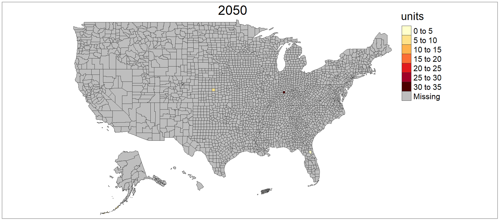</p>


<!-------------------------->
<!-------------------------->
# Create Custom Map Shape
<p align="center"> </p>
<!-------------------------->
<!-------------------------->

Users can provide metis.mapsProcess custom shapefiles for their own data if needed. The example below shows how to create a custom shapefile and then plot data on it. 

## Subset existing shape

```{r, eval=F}
library(metis); library(rgdal)

shapeSubset <- metis::mapStates # Read in World States shape file
shapeSubset <- shapeSubset[shapeSubset@data$region %in% c("Colombia"),] # Subset the shapefile to Colombia
shapeSubset@data <- droplevels(shapeSubset@data)
shapeSubset@data <- shapeSubset@data %>% dplyr::rename(states=subRegion) # Lets assume the subRegion column was called "states"
metis.map(shapeSubset,fillCol="states") # View custom shape
head(shapeSubset@data) # review data
unique(shapeSubset@data$states) # Get a list of the unique subRegions

# Plot data on subset
data = data.frame(states=c("Cauca","Valle del Cauca","Antioquia","Córdoba","Bolívar","Atlántico"),
                  x=c(2050,2050,2050,2050,2050,2050),
                  value=c(5,10,15,34,2,7))
metis.mapsProcess(polygonTable=data,
                  subRegShape = shapeSubset,
                  subRegCol = "states",
                  subRegType = "ColombiaStates",
                  folderName = "vignetteMaps_shapeSubset",
                  mapTitleOn = F)

```


<p align="center" style="font-size:18px;"> *Shape subset* </p>
<p align="center"> </p>

## Crop a shape to another shape

For example if someone wants to analyze counties in Texas.

```{r, eval=F}
library(metis); library(raster)

shapeSubRegions <- metis::mapUS49County
shapeCropTo <- metis::mapUS49
shapeCropTo <- shapeCropTo[shapeCropTo@data$subRegion %in% c("TX"),]
shapeCropTo@data <- droplevels(shapeCropTo@data)
shapeCrop<- sp::spTransform(shapeCropTo,raster::crs(shapeSubRegions))
shapeCrop <-raster::crop(shapeSubRegions,shapeCropTo)
shapeCrop@data <- shapeCrop@data%>%dplyr::select(subRegion)
shapeCrop$subRegion%>%unique() # Check subRegion names
metis.map(shapeCrop)

# Plot data on subset
data = data.frame(county=c("Wise_TX","Scurry_TX","Kendall_TX","Frio_TX","Hunt_TX","Austin_TX"),
                  x=c(2050,2050,2050,2050,2050,2050),
                  value=c(5,10,15,34,2,7))
metis.mapsProcess(polygonTable=data,
                  subRegShape = shapeCrop,
                  subRegCol = "county",
                  subRegType = "TexasCounties",
                  folderName = "vignetteMaps_shapeCrop",
                  mapTitleOn = F)

```

<p align="center" style="font-size:18px;"> *Shape Crop* </p>
<p align="center"> 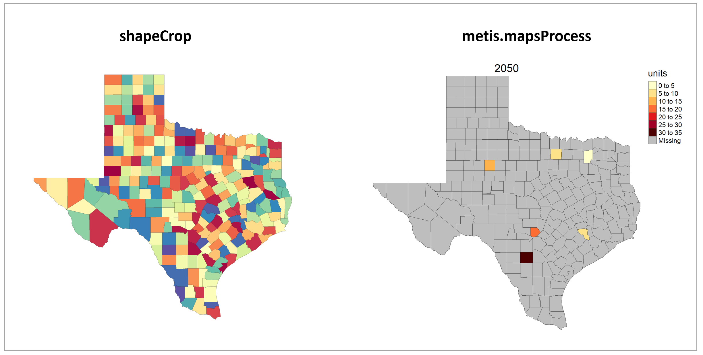</p>

<!-------------------------->
<!-------------------------->
# Crop to Boundary
<p align="center"> </p>
<!-------------------------->
<!-------------------------->

By setting the **cropToBoundary** argument to **T** the function will crop your map to the regions with data provided. This is particularly helpful for data plotted on the world maps as shown in the example below:

```{r, eval=F}
library(metis)
data = data.frame(subRegion = c("India","China"), year=c(2010,2010),value = c(32,54))
metis.mapsProcess(polygonTable = data, mapTitleOn = F, folderName = "vignetteMaps", cropToBoundary=F, )
metis.mapsProcess(polygonTable = data, mapTitleOn = F, folderName = "vignetteMaps", cropToBoundary=T, 
                  nameAppend="Cropped")
```


<p align="center" style="font-size:18px;"> *Crop to Boundary* </p>
<p align="center"> </p>

<!-------------------------->
<!-------------------------->
# Plot Background
<p align="center"> </p>
<!-------------------------->
<!-------------------------->

By turning on **extension** a background layer will be added to any shape map.

```{r, eval=F}
library(metis)
data = data.frame(
  subRegion = c("India","China"), year=c(2010,2010), value = c(32,54))
metis.mapsProcess(polygonTable = data, mapTitleOn=F, folderName = "vignetteMaps", 
                  cropToBoundary =T,
                  extension = T, nameAppend="Extended")

# Can increase the extnded boundaries by using expandPercent
metis.mapsProcess(polygonTable = data, mapTitleOn=F, folderName = "vignetteMaps", 
                  cropToBoundary =T,
                  extension = T, nameAppend="Extended10", expandPercent = 50)
```

<p align="center" style="font-size:18px;"> *Extended Background* </p>
<p align="center"> 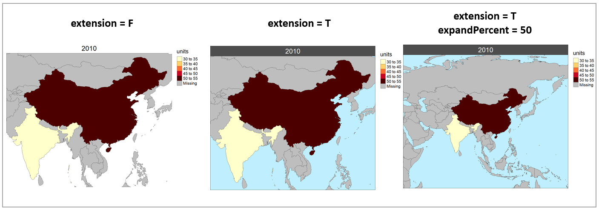</p>

<!-------------------------->
<!-------------------------->
# Multi-Scenario Diff plots
<p align="center"> </p>
<!-------------------------->
<!-------------------------->

With multiple scenarios assigning a **scenRef** calculates the absolute and percentage difference between the different scenarios and stores them in corresponding folders.

```{r, eval=F}
library(metis)
data = data.frame(subRegion = c("Austria","Spain", "Italy", "Germany","Greece",
                                "Austria","Spain", "Italy", "Germany","Greece"),
                  scenario = c("scen1","scen1","scen1","scen1","scen1",
                               "scen2","scen2","scen2","scen2","scen2"),
                  year = rep(2010,10),
                  value = c(32, 38, 54, 63, 24,
                            37, 53, 23, 12, 45))
metis.mapsProcess(polygonTable = data, folderName ="multiScenario", 
                  cropToBoundary=T, extension = T, scenRef="scen1")
```


<p align="center" style="font-size:18px;"> *Multi-scenario* </p>
<p align="center"> 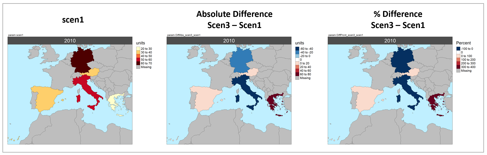</p>

<p align="center" style="font-size:18px;"> *Multi-scenario Folders* </p>
<p align="center"> 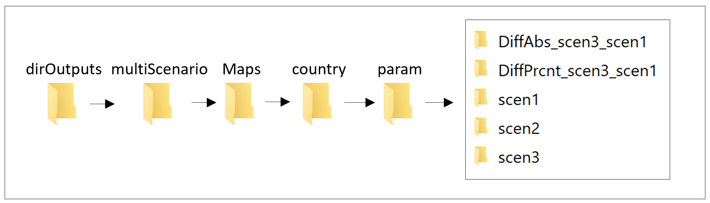</p>


<!-------------------------->
<!-------------------------->
# Scale Range
<p align="center"> </p>
<!-------------------------->
<!-------------------------->

```{r, eval=F}
library(metis)
data = data.frame(subRegion = c("Austria","Spain", "Italy", "Germany","Greece",
                                "Austria","Spain", "Italy", "Germany","Greece"),
                  scenario = c("scen1","scen1","scen1","scen1","scen1",
                               "scen2","scen2","scen2","scen2","scen2"),
                  year = rep(2010,10),
                  value = c(32, 38, 54, 63, 24,
                            37, 53, 23, 12, 45))
metis.mapsProcess(polygonTable = data, folderName ="scaleRange", 
                  cropToBoundary=T, extension = T, scenRef="scen1", 
                  scaleRange = c(0,50), scaleRangeDiffAbs = c(-100,100), scaleRangeDiffPrcnt = c(-60,60))
```


<p align="center" style="font-size:18px;"> *Scale Range* </p>
<p align="center"> 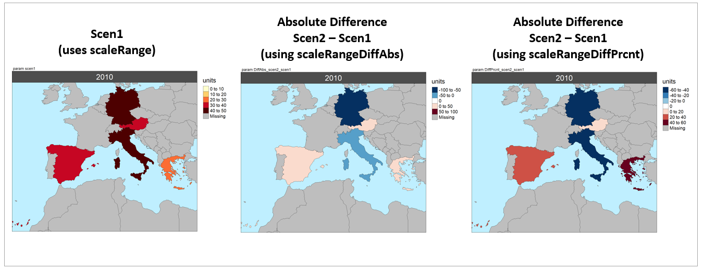</p>


<!-------------------------->
<!-------------------------->
# Color Palettes
<p align="center"> </p>
<!-------------------------->
<!-------------------------->

Can use any [R color palette](https://www.nceas.ucsb.edu/sites/default/files/2020-04/colorPaletteCheatsheet.pdf) or choose from a list of metis color palettes at [colors, maps and params](https://jgcri.github.io/metis/articles/vignette_colorsMapsParams.html#color-palettes-1).

```{r, eval=F}
library(metis)
data = data.frame(subRegion = c("Austria","Spain", "Italy", "Germany","Greece",
                                "Austria","Spain", "Italy", "Germany","Greece"),
                  scenario = c("scen1","scen1","scen1","scen1","scen1",
                               "scen2","scen2","scen2","scen2","scen2"),
                  year = rep(2010,10),
                  value = c(32, 38, 54, 63, 24,
                            37, 53, 23, 12, 45))
metis.mapsProcess(polygonTable = data, folderName ="colorPalettes", 
                  cropToBoundary=T, extension = T, scenRef="scen1",
                  classPalette = "pal_wet", classPaletteDiff = "pal_div_BrGn")

```


<p align="center" style="font-size:18px;"> *Color Palettes* </p>
<p align="center"> </p>


<!-------------------------->
<!-------------------------->
# Multi-Year & Animations
<p align="center"> </p>
<!-------------------------->
<!-------------------------->

```{r, eval=F}
library(metis)
data = data.frame(subRegion = c("Austria","Spain", "Italy", "Germany","Greece",
                                "Austria","Spain", "Italy", "Germany","Greece",
                                "Austria","Spain", "Italy", "Germany","Greece",
                                "Austria","Spain", "Italy", "Germany","Greece"),
                  year = c(rep(2025,5),
                               rep(2050,5),
                               rep(2075,5),
                               rep(2100,5)),
                  value = c(32, 38, 54, 63, 24,
                            37, 53, 23, 12, 45,
                            23, 99, 102, 85, 75,
                            12, 76, 150, 64, 90))
metis.mapsProcess(polygonTable = data, folderName ="multiYear", 
                  cropToBoundary=T, extension = T )
```


<p align="center" style="font-size:18px;"> *Multi-year* </p>
<p align="center"> 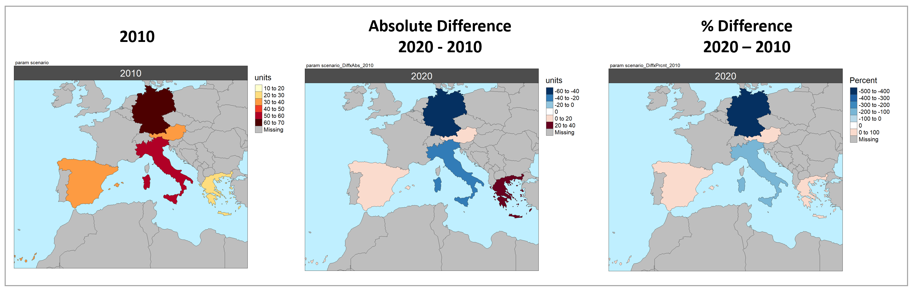</p>

<p align="center" style="font-size:18px;"> *Multi-year Animation* </p>
<p align="center"> </p>


<!-------------------------->
<!-------------------------->
# Multi-Class
<p align="center"> </p>
<!-------------------------->
<!-------------------------->

```{r, eval=F}
library(metis)
data = data.frame(subRegion = c("Austria","Spain", "Italy", "Germany","Greece",
                                "Austria","Spain", "Italy", "Germany","Greece",
                                "Austria","Spain", "Italy", "Germany","Greece",
                                "Austria","Spain", "Italy", "Germany","Greece"),
                  class = c(rep("municipal",5),
                               rep("industry",5),
                               rep("agriculture",5),
                               rep("transport",5)),
                  year = rep(2010,20),
                  value = c(32, 38, 54, 63, 24,
                            37, 53, 23, 12, 45,
                            23, 99, 102, 85, 75,
                            12, 76, 150, 64, 90))
metis.mapsProcess(polygonTable = data, folderName ="multiClass", 
                  cropToBoundary=T, extension = T )
```


<p align="center" style="font-size:18px;"> *Multi-class* </p>
<p align="center"> </p>


<!-------------------------->
<!-------------------------->
# GCAM Results
<p align="center"> </p>
<!-------------------------->
<!-------------------------->

GCAM results can be read using [metis.readgcam](https://jgcri.github.io/metis/articles/vignette_metis.readgcam.html) to get the data directly into the format ready for mapping. In this example the preloaded GCAM output `metis::exampleGCAMproj` is used to extract data for chosen parameters from the [parameter list](https://jgcri.github.io/metis/articles/vignette_colorsMapsParams.html#params-1). USers can provided a path to their gcam database folder.

**Note: The exampleGCAMproj comes with only a few parameters: "elecByTechTWh","pop","watWithdrawBySec","watSupRunoffBasin","landAlloc" and "agProdByCrop"**


```{r, eval=F}
library(metis)

# Read in data from the example Proj file
data <- metis.readgcam (
           #gcamdatabase = “Path_to_GCAMdatabase”,
           dataProjFile = metis::exampleGCAMproj,
           scenOrigNames = c("GCAM_SSP5","GCAM_SSP3"),
           scenNewNames = c("SSP5","SSP3"),
           paramsSelect = c("landAlloc", "elecByTechTWh","watSupRunoffBasin","pop"),  # From Param list ?metis.readgcam
           regionsSelect = c("India","China","Pakistan"))

df <- data$data; df
dfParam <- data$dataAggParam; dfParam
dfClass1 <- data$dataAggClass1; dfClass1
dfClass2 <- data$dataAggClass1; dfClass2

# Plot data aggregated by param
metis.mapsProcess(polygonTable = dfParam, folderName ="GCAMbyParam", 
                  cropToBoundary=T, extension = T, xRange = c(2010,2020,2030,2040),
                  scenRef="SSP3", scaleRange = data.frame(param=c("landAlloc", "elecByTechTWh","watSupRunoffBasin","pop"),
                                                          min = c(0,0,0,0),
                                                          max = c(10000,15000,2000,2000)))

# polygonTable = dfParam; folderName ="GCAMbyParam";
#                   cropToBoundary=T; extension = T; xRange = c(2010,2020,2030,2040);
#                   scenRef="SSP3"; scaleRange = data.frame(param=c("landAlloc", "elecByTechTWh","watSupRunoffBasin","pop"),
#                                                           min = c(0,0,0,0),
#                                                           max = c(10000,15000,2000,2000))

# Plot data aggregated by Class1
metis.mapsProcess(polygonTable = dfClass1, folderName ="GCAMbyClass", 
                  cropToBoundary=T, extension = T, xRange = c(2010,2020,2030,2040),
                  scenRef="SSP3")
```


<p align="center" style="font-size:18px;"> *GCAM Outputs Folder Structure* </p>
<p align="center"> </p>


<p align="center" style="font-size:18px;"> *GCAM Maps by Param (Selected)* </p>
<p align="center"> 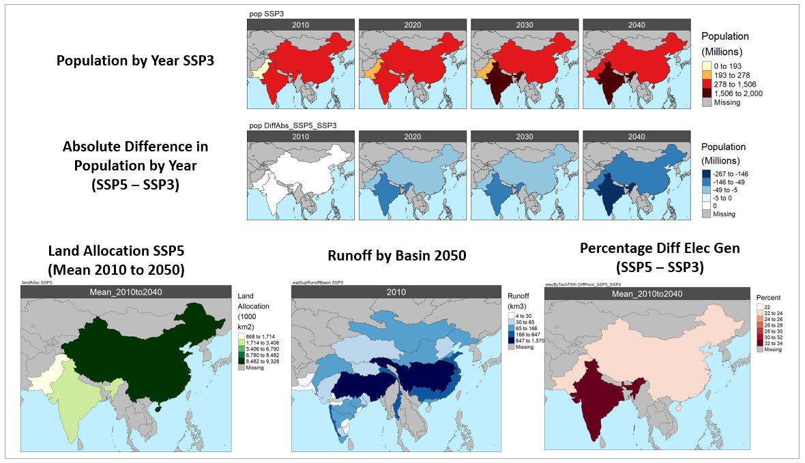</p>

<p align="center" style="font-size:18px;"> *GCAM Maps by Param Animations (Selected)* </p>
Pop |  Electricity (TWh)
:-------------------------:|:-------------------------:
  |  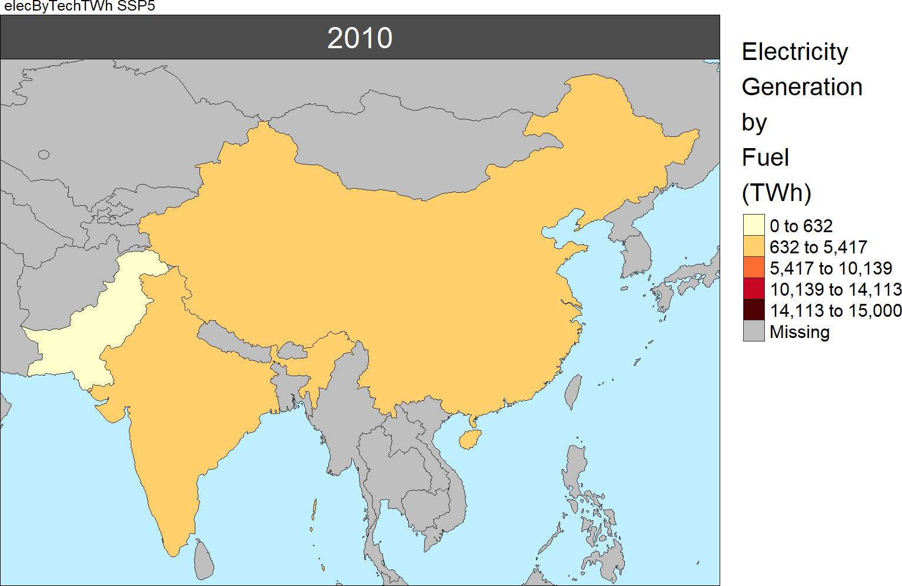  

Land Allocation |  Water Withdrawals
:-------------------------:|:-------------------------:
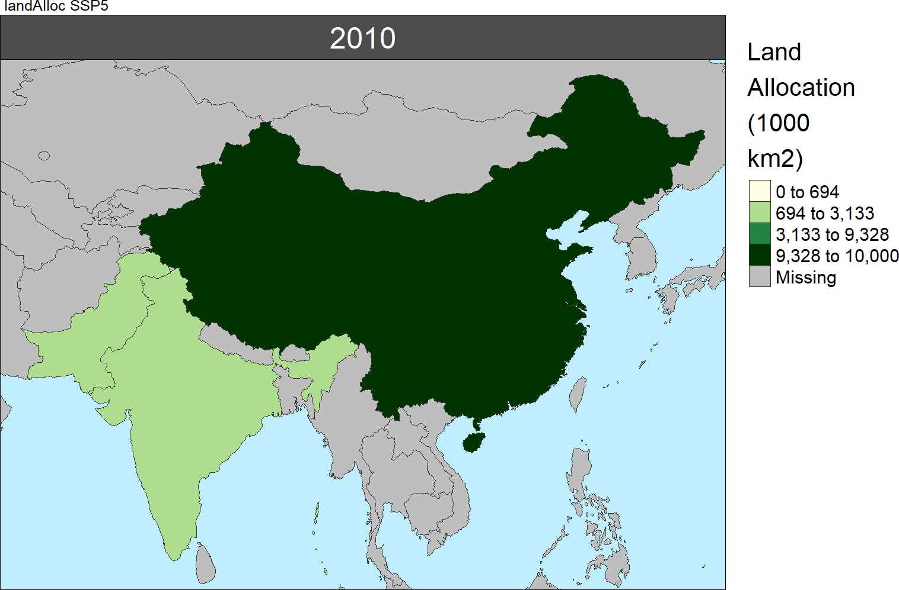  |  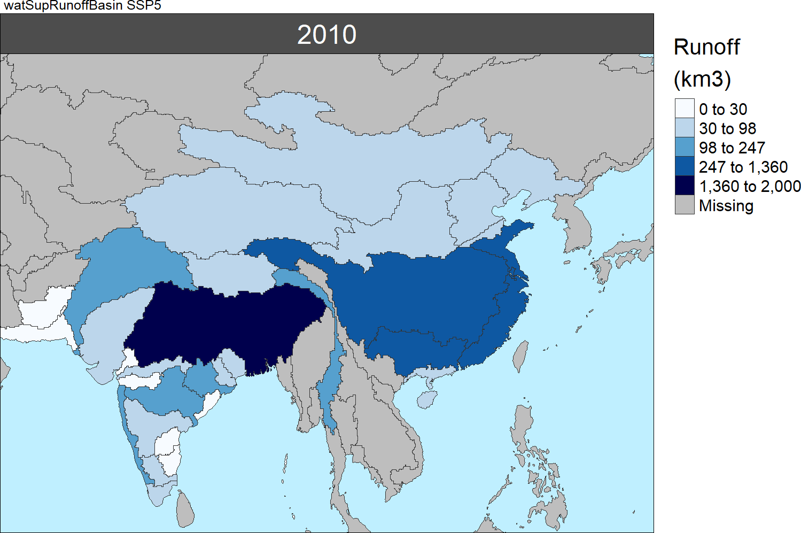  


<p align="center" style="font-size:18px;"> *GCAM Maps by Class (Selected)* </p>
<p align="center"> 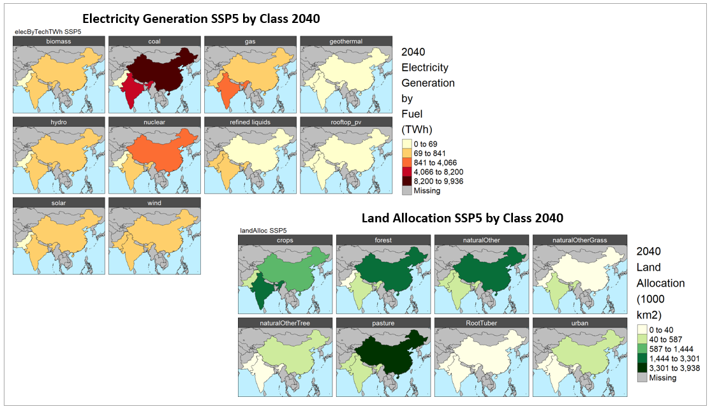</p>

<p align="center" style="font-size:18px;"> *GCAM Maps by Class Animations (Selected)* </p>
Electricity (TWh) | Land Allocation
:-------------------------:|:-------------------------:
  |  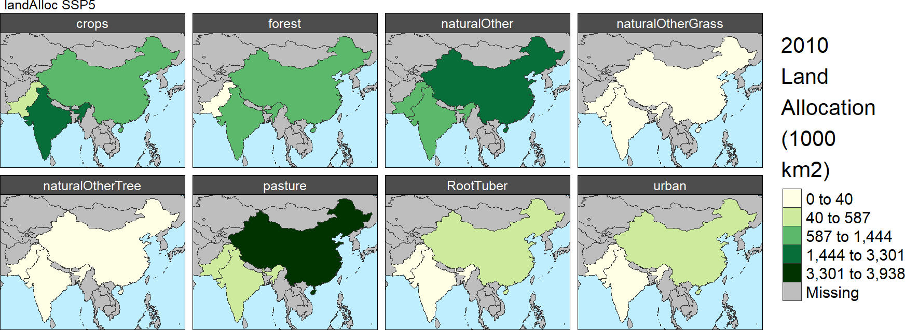  
